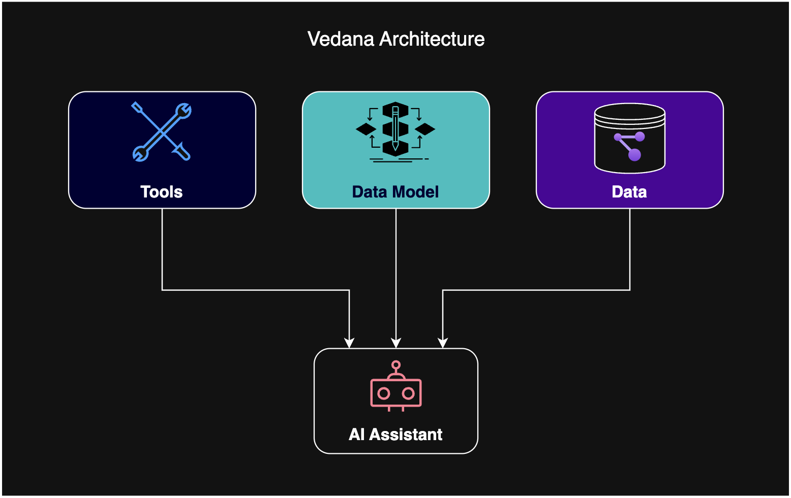

# Vedana

[](LICENSE)
[](https://github.com/epoch8/vedana/actions)
[](https://www.python.org/downloads/)
[](https://vedana.tech/docs/)
[](https://github.com/epoch8/vedana/stargazers)

> **Open-source multi-agent RAG over a knowledge graph.**
> Instead of guessing answers from text similarity, Vedana agents *navigate* a typed graph step by step — issuing Cypher queries, running vector search, verifying sources, and assembling answers from real data.



[**Quickstart**](#quickstart) · [**Documentation**](https://vedana.tech/docs/) · [**Concepts**](docs/concepts/what-is-vedana.md) · [**Discussions**](https://github.com/epoch8/vedana/discussions)

---

## Why Vedana

Classic RAG works well for summarization and vague questions, but breaks the moment you need **completeness**, **structure**, or **logic**:

- *"How many contracts expire this quarter?"* — classic RAG guesses from top-K, not from the dataset.
- *"All documents regulating category X"* — top-K returns a sample. Missed items are invisible.
- *"Which products in category X are regulated by which documents?"* — that's a graph traversal, not a similarity match.

These failures are **structural** — better embeddings, larger context windows, and bigger top-K don't fix them.

**Vedana takes a different path.** It treats the LLM as an *interpreter*, not a source of truth: an explicit data model is loaded into a knowledge graph + vector store, and agents query it through tools (Cypher, vector search, document lookup). Every answer is traceable — you can see exactly which nodes, edges, and chunks contributed to it.

Read more: [What is Vedana](docs/concepts/what-is-vedana.md) · [Why Classic RAG Fails](docs/concepts/why-classic-rag-fails.md) · [Semantic RAG Overview](docs/concepts/semantic-rag-overview.md).

## Quickstart

1. Copy and fill the environment file:

   ```bash
   cp apps/vedana/.env.example apps/vedana/.env
   # edit apps/vedana/.env — at minimum, set OPENAI_API_KEY
   ```

2. Bring up the stack:

   ```bash
   docker-compose -f apps/vedana/docker-compose.yml up --build -d
   ```

3. Open the backoffice at `http://localhost:3000` and ask your first question.

Full walkthrough: [Quick Start](docs/getting-started/quick-start.md). For development on Vedana itself (native Python with `uv`, infra in Docker), see [Local Development](docs/getting-started/local-development.md).

## What's in this repo

```
vedana/
├── apps/
│   ├── vedana/              # Main Vedana deployment (Docker, Reflex backoffice, ETL)
│   └── jims-demo/           # Minimal JIMS demo (a CLI-style agent on the JIMS framework)
├── libs/
│   ├── jims-core/           # Thread/event/pipeline framework (the substrate Vedana runs on)
│   ├── jims-api/            # FastAPI HTTP API over JIMS threads
│   ├── jims-backoffice/     # Backoffice primitives for JIMS-based apps
│   ├── jims-telegram/       # Telegram adapter for JIMS
│   ├── jims-tui/            # Terminal UI for testing JIMS pipelines
│   ├── jims-widget/         # Embeddable chat widget for JIMS
│   ├── jims-max/            # Internal MAX/VK adapter (optional)
│   ├── vedana-core/         # The RAG pipeline: data-model filtering, Cypher generation, vector search, answer synthesis
│   ├── vedana-backoffice/   # Reflex admin UI for Vedana (chat, ETL runner, metrics, prompt tuning)
│   └── vedana-etl/          # Datapipe-based incremental ETL: Grist → Memgraph + pgvector
├── docs/                    # Documentation — built and published to vedana.tech
└── pyproject.toml           # uv workspace root
```

The repository is a [uv workspace](https://docs.astral.sh/uv/concepts/projects/workspaces/). For a one-shot setup of all dependencies:

```bash
uv sync
```

For architecture in depth — see [docs/architecture/overview.md](docs/architecture/overview.md).

## Components at a glance

**JIMS** — *Just an Integrated Multiagent System*. A framework for running conversational agents with persistent threads, typed events, and pluggable pipelines. Vedana itself is just one JIMS pipeline; `apps/jims-demo` is a minimal one.

**Vedana Core** — the Semantic RAG pipeline: receives a user message, optionally filters the data model, lets the LLM generate Cypher / vector-search tool calls, retrieves results, and synthesizes a sourced answer.

**Vedana ETL** — an incremental [Datapipe](https://github.com/epoch8/datapipe) pipeline that pulls the data model and the data itself from [Grist](https://github.com/gristlabs/grist-core) and loads them into [Memgraph](https://memgraph.com/) (knowledge graph) and [pgvector](https://github.com/pgvector/pgvector) (embeddings).

**Vedana Backoffice** — a [Reflex](https://reflex.dev/) admin UI for running ETL, chatting with the assistant, viewing metrics, and tuning prompts.

| Interface | Package |
| --- | --- |
| Telegram bot | `jims-telegram` |
| Terminal UI | `jims-tui` |
| Embeddable widget | `jims-widget` |
| HTTP API | `jims-api` |
| Reflex admin | `vedana-backoffice` |

## Requirements

- Python 3.12
- PostgreSQL with the **pgvector** extension
- Memgraph
- Grist (the default data-model/data source — ETL can be extended to other sources)
- An LLM provider — OpenAI, OpenRouter, or anything supported by [LiteLLM](https://www.litellm.ai/)

> **Note on pgvector:** some hosted Postgres providers (Supabase, Neon, etc.) manage extensions on their own. Set `CREATE_PGVECTOR_EXTENSION=false` in `.env` to skip the `CREATE EXTENSION` step. See [Configuration](docs/getting-started/configuration.md) for the full env reference.

## Documentation

Browsable documentation lives at **[vedana.tech/docs](https://vedana.tech/docs/)** and is built from the [`docs/`](docs/) folder in this repository.

Highlights:

- [Getting Started](docs/getting-started/) — Quick Start, Local Development, Configuration.
- [Concepts](docs/concepts/) — what Vedana is, why classic RAG fails, Semantic RAG overview, data model, playbook.
- [Architecture](docs/architecture/) — JIMS Core, Vedana Core, ETL, Backoffice, Storage Model, Observability.
- [Data Model](docs/data-model/) — anchors, attributes, links, queries, prompts.
- [Data Ingestion](docs/data-ingestion/) — documents, structured data, FAQ, custom ETL.
- [Guides](docs/guides/) — adding anchors / attributes / links / documents / custom tools, tuning embeddings, multi-tenancy.
- [API Reference](docs/api/) — HTTP, Widget, Telegram, Python, env-vars.
- [Operations](docs/operations/) — Deployment, Monitoring, Troubleshooting, Costs, Security.
- [Product](docs/product/) — Use Cases, Comparison with classic RAG, Evaluation, Limitations, FAQ.

## Observability

OpenTelemetry traces, Prometheus metrics, and optional Sentry integration are wired into every pipeline run. See [Observability](docs/architecture/observability.md) and [Monitoring](docs/operations/monitoring.md).

## Contributing

We welcome contributions — bug reports, feature requests, docs fixes, and code. Start here:

- [CONTRIBUTING.md](CONTRIBUTING.md) — dev setup, code style, commit conventions, PR process.
- [Repository Structure](docs/contributing/repository-structure.md) — where things live and why.
- [Code Style](docs/contributing/code-style.md) — ruff, mypy, formatting rules.
- [Testing](docs/contributing/testing.md) — running the test suite, integration tests, fixtures.
- [Code of Conduct](CODE_OF_CONDUCT.md) — Contributor Covenant v2.1.

Security issues: see [SECURITY.md](SECURITY.md).

## License

Vedana is distributed under the **[Apache License 2.0](LICENSE)** — free for commercial and non-commercial use, including modification and redistribution, with attribution and a notice of changes.

## Acknowledgements

Vedana stands on the shoulders of:

- [Memgraph](https://github.com/memgraph/memgraph) — the knowledge graph backend.
- [pgvector](https://github.com/pgvector/pgvector) — vector search inside Postgres.
- [Grist](https://github.com/gristlabs/grist-core) — the spreadsheet-as-a-database that drives the data model and ingestion.
- [Datapipe](https://github.com/epoch8/datapipe) — the incremental-ETL engine behind `vedana-etl`.
- [LiteLLM](https://www.litellm.ai/) — uniform access to dozens of LLM providers.
- [Reflex](https://reflex.dev/) — the Python framework powering the backoffice.

Built by [Epoch8](https://epoch8.com).
