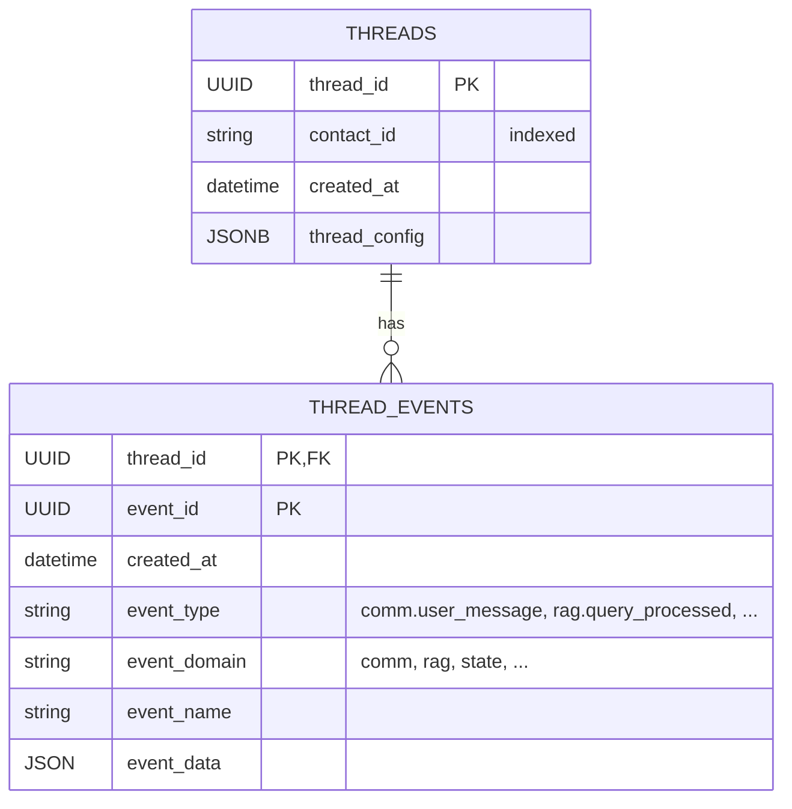
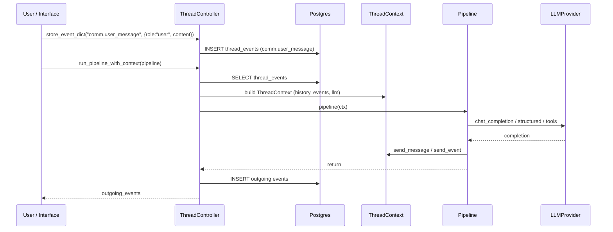

# JIMS Core

**JIMS** (*Just an Integrated Multiagent System*) is a framework for building conversational AI with persistent thread management. Vedana is built on top of JIMS, but JIMS can also be used without Vedana for other scenarios.

## Key concepts

- **Thread** — a conversation between a user (or several users) and the agent system.
- **Event** — anything that happens in a thread: a message, an action, a state change.
- **Pipeline** — an async function that processes a `ThreadContext` and produces events.
- **ThreadContext** — the object the ThreadController hands to the pipeline. Holds history, events, and the LLM provider.
- **ThreadController** — manages the thread lifecycle, event storage, and pipeline execution.

## Storage

JIMS stores threads and events in Postgres (with SQLite compatibility for tests). The schema:



```python
class ThreadDB(Base):
    __tablename__ = "threads"
    thread_id: UUID  # primary key
    contact_id: str  # indexed
    created_at: datetime
    thread_config: JSONB  # arbitrary thread configuration

class ThreadEventDB(Base):
    __tablename__ = "thread_events"
    thread_id: UUID  # primary
    event_id: UUID   # primary
    created_at: datetime  # server_default=now()
    event_type: str       # full type, e.g. "comm.user_message.user1"
    event_domain: str     # "comm" (nullable; currently NOT populated by ThreadController)
    event_name: str       # "user_message" (nullable; currently NOT populated by ThreadController)
    event_data: JSON      # payload (Postgres JSON, see note below)
```

Notes:

- `event_data` is stored as Postgres `JSON` (not `JSONB`). See `jims_core/db.py:46`.
- `event_domain` and `event_name` columns exist in the schema but are not populated by `ThreadController.store_event_dict` / `store_user_message` / `store_assistant_message` — only `event_type` is written. They remain `NULL`.
- `created_at` is set by the server.
- One thread = one chain of events ordered by `created_at`.

`ThreadController.make_context()` reads every `thread_event` for the thread, filters `comm.*` into `history`, and the rest goes into `events`.

## Pipeline execution flow



## ThreadController

`jims_core.thread.thread_controller.ThreadController` is the entry point to threads.

### Creating / finding a thread

```python
ctl = await ThreadController.new_thread(
    sessionmaker=app.sessionmaker,
    contact_id="user-42",
    thread_id=uuid7(),
    thread_config={"interface": "api"},
)

# or
ctl = await ThreadController.from_thread_id(sessionmaker, thread_id)
ctl = await ThreadController.latest_thread_from_contact_id(sessionmaker, from_contact_id=contact_id)
```

When a new thread is created, a `jims.lifecycle.thread_created` event is automatically recorded.

### Recording messages and events

```python
await ctl.store_user_message(event_id=uuid7(), content="Hello!")
await ctl.store_assistant_message(event_id=uuid7(), content="Hi!")
await ctl.store_event_dict(event_id=uuid7(), event_type="custom.event", event_data={...})
```

User and assistant messages are stored as events with types `comm.user_message` / `comm.assistant_message`, with payloads of the form `{"role": "user|assistant", "content": "..."}`.

### Running a pipeline

```python
ctx = await ctl.make_context()  # reads every thread event from the DB
outgoing = await ctl.run_pipeline_with_context(my_pipeline, ctx)
```

`run_pipeline_with_context` wraps execution in an OpenTelemetry span, measures duration, increments `jims_pipeline_runs_total{status,pipeline}` and `jims_pipeline_run_duration_seconds`. After completion, every `outgoing_event` produced by the pipeline is written to the DB.

## ThreadContext

`jims_core.thread.thread_context.ThreadContext` is what the pipeline sees.

```python
@dataclass
class ThreadContext:
    thread_id: UUID
    history: list[CommunicationEvent]   # filtered by comm.*
    events: list[EventEnvelope]          # every event
    llm: LLMProvider
    outgoing_events: list[EventEnvelope] # what the pipeline plans to record
    thread_config: dict
    status_updater: StatusUpdater | None
```

### Reading

- `ctx.get_last_user_message()` — the last user message.
- `ctx.get_last_user_action()` — the last user action in the `comm.*` domain (including buttons, commands).
- `ctx.context(conversation_length=20)` — enriched history: the last N `comm.*` messages, interleaved (by `created_at`) with any `context.*` events that fall into the same window (for example, reasoning from data model filtering). Note: the current implementation collects **all** `context.*` events from the window in reverse order; the linkage to a specific `comm.*` message is by time-ordering, not by an explicit relation. Vedana uses this method to feed the LLM with context.
- `ctx.get_state(state_name, state_type)` — the latest state of type `state_type`.

### Writing

- `ctx.send_message(text)` — send an assistant message into the thread.
- `ctx.send_event(event_type, data)` — an arbitrary event (e.g. `rag.query_processed`).
- `ctx.set_state(state_name, state)` — record a `state.set.{state_name}` event.
- `await ctx.update_agent_status(status)` — update the status (passed to the `StatusUpdater` if one is set by the interface).

`StatusUpdater` is an interface hook: in the Telegram bot, for example, it shows "is typing…"/"analysing query…" in the chat window; in the Reflex chat it updates the UI.

## Pipeline protocol

```python
from jims_core.schema import Pipeline

class Pipeline(Protocol):
    async def __call__(self, ctx: ThreadContext) -> Any: ...
```

Any class or function with this interface is a valid pipeline. In Vedana the pipelines are instances of `RagPipeline` and `StartPipeline` (see `vedana_core.rag_pipeline`).

## JimsApp

`jims_core.app.JimsApp` is the application-level DI container.

```python
@dataclass
class JimsApp:
    sessionmaker: async_sessionmaker
    pipeline: Pipeline                       # main pipeline
    conversation_start_pipeline: Pipeline | None = None  # runs on /start
```

`JimsApp.new_thread(contact_id, thread_id, thread_config)` is a shortcut for `ThreadController.new_thread`.

In Vedana the instance is assembled in `vedana_core.app.make_jims_app` and bound to a global variable `app` (the entry point for CLI scripts).

## LLMProvider

`jims_core.llms.llm_provider.LLMProvider` is a wrapper over [LiteLLM](https://www.litellm.ai/) that:

- manages the model name and API key (mutable at runtime via `set_model`);
- collects usage metrics (Prometheus + a local `usage: dict[str, ModelUsage]`);
- supports:
  - `chat_completion_plain(messages)` — a regular chat completion;
  - `chat_completion_with_tools(messages, tools)` — function calling;
  - `chat_completion_structured(messages, response_format)` — structured output (used in data model filtering);
  - `create_embedding(text)`, `create_embeddings(texts)` — embeddings with automatic batching by `EMBEDDINGS_MAX_BATCH_SIZE` and `EMBEDDINGS_MAX_TOKENS_PER_BATCH`;
- retries calls via `backoff` (3 attempts, exponential back-off).

Metrics:

- `llm_calls_total{model}`
- `llm_usage_prompt_tokens_total{model}`
- `llm_usage_completion_tokens_total{model}`

`cached_tokens` (if the provider reports them) and `requests_cost` (via LiteLLM's `_hidden_params.response_cost`) are also captured on `ModelUsage`.

## Metrics and tracing

`ThreadController.run_pipeline_with_context` opens an OTel span `jims.run_pipeline_with_context` with the attributes `jims.thread.id` and `jims.pipeline`. Below it, spans are created for Memgraph queries (`memgraph.execute_ro_cypher_query`, `memgraph.run_cypher`, `memgraph.text_search`, `memgraph.vector_search`) and for pgvector (`pgvector.vector_search`).

Details — [Observability](./architecture/observability.md).
