# Observability

Vedana is built to run under load: tracing, metrics, and Sentry integration.

## OpenTelemetry

Traces are created in several places:

| Span                                  | Where                                                | Attributes                                                       |
| ------------------------------------- | ----------------------------------------------------- | ----------------------------------------------------------------- |
| `jims.run_pipeline_with_context`      | `jims_core.thread.thread_controller`                  | `jims.thread.id`, `jims.pipeline`                                 |
| `memgraph.execute_ro_cypher_query`    | `vedana_core.graph.MemgraphGraph`                     | `memgraph.query`, `memgraph.parameters`                          |
| `memgraph.run_cypher`                 | `vedana_core.graph.MemgraphGraph`                     | `memgraph.query`, `memgraph.parameters`, `memgraph.limit`        |
| `memgraph.text_search`                | `vedana_core.graph.MemgraphGraph`                     | `memgraph.label`, `memgraph.fts_query`, `memgraph.limit`         |
| `memgraph.vector_search`              | `vedana_core.vts.MemgraphVectorStore`                 | label, prop_type, prop_name, top_n, threshold, query             |
| `pgvector.vector_search`              | `vedana_core.vts.PGVectorStore`                       | same + the generated SQL                                           |

Typical trace hierarchy (the `llm.*` rows below are illustrative — the actual span names come from `openinference.instrumentation.litellm` and use the provider/operation names from LiteLLM, e.g. `litellm.completion`. Vedana does not create custom `llm.chat_completion_*` spans itself):

```mermaid
gantt
    title Example OTel trace of one request (≈12.4s)
    dateFormat X
    axisFormat %s

    section Pipeline
    jims.run_pipeline_with_context :a1, 0, 12400

    section Filter step
    litellm.completion (FILTER_MODEL, structured) :a2, 100, 1200

    section Tool iter 1
    litellm.completion (with tools) :a3, 1300, 3500
    memgraph.execute_ro_cypher_query :a4, 4500, 200
    pgvector.vector_search :a5, 4500, 100

    section Tool iter 2
    litellm.completion (with tools) :a6, 5000, 4100
    memgraph.execute_ro_cypher_query :a7, 8800, 300

    section Final answer
    litellm.completion (with tools) :a8, 9300, 3000
```



Exporter configuration is done through the standard ENV variables of the [OpenTelemetry SDK](https://opentelemetry.io/docs/languages/python/exporters/):

- `OTEL_EXPORTER_OTLP_ENDPOINT`
- `OTEL_SERVICE_NAME`
- `OTEL_RESOURCE_ATTRIBUTES`
- and so on.

`jims_core.util.setup_monitoring_and_tracing_with_sentry()` plugs Sentry into the OTel pipeline.

## Prometheus metrics

### LLM (`jims_core.llms.llm_provider`)

| Metric                                | Type     | Labels   | What it counts                          |
| ------------------------------------- | -------- | -------- | ---------------------------------------- |
| `llm_calls_total`                      | Counter | `model`  | number of LLM calls                      |
| `llm_usage_prompt_tokens_total`        | Counter | `model`  | prompt tokens consumed                    |
| `llm_usage_completion_tokens_total`    | Counter | `model`  | completion tokens consumed                |

Beyond Prometheus, `LLMProvider` keeps a local `usage: dict[str, ModelUsage]` counter with full parameters (prompt, completion, cached, request_cost). That data is included in `rag.query_processed.event_data.technical_info.model_stats`.

### Pipeline (`jims_core.thread.thread_controller`)

| Metric                                | Type        | Labels                | What it measures                  |
| ------------------------------------- | ----------- | --------------------- | ---------------------------------- |
| `jims_pipeline_runs_total`             | Counter     | `status`, `pipeline`  | number of pipeline runs           |
| `jims_pipeline_run_duration_seconds`   | Histogram   | `status`, `pipeline`  | duration with buckets 0.1…600s    |

`status` is `success` or `failure`. `pipeline` is the class/function name.

### Starting metrics

JIMS CLIs accept a `--metrics-port` option. Defaults differ per service so two services can run on the same host without colliding: `jims-api` / `jims-telegram` default to **8000**; `jims-widget` defaults to **8001**. Run, for example:

```bash
uv run python -m jims_api.main --app vedana_core.app:app --port 8080 --metrics-port 8000
```

`--port 8080` sets the API's own HTTP port; `--metrics-port 8000` runs the Prometheus scrape endpoint at `http://host:8000/metrics`. `setup_prometheus_metrics(port=...)` brings up the standard Prometheus client HTTP server.

## Sentry

Enabled by the `--enable-sentry` CLI flag. Configuration:

- `SENTRY_DSN` — required.
- `SENTRY_ENVIRONMENT` — environment name.

What goes to Sentry:

- unhandled exceptions raised out of pipelines (anything not caught by `RagPipeline`'s `try`/`except`);
- OpenTelemetry spans, via the Sentry → OTel integration (`setup_monitoring_and_tracing_with_sentry` registers a `SentrySpanProcessor` on the tracer provider).

> **Note on tool-call errors:** there is no dedicated `loguru` → Sentry handler in `setup_monitoring_and_tracing_with_sentry` (`jims_core/util.py:24-49`). Tool-call errors inside `LLM.create_completion_with_tools` are caught with `logger.exception(...)` and returned to the LLM as a string — they don't propagate out, so they only surface in Sentry if `sentry_sdk`'s default `LoggingIntegration` picks them up.

## What to log

Vedana uses `loguru` for applications and the standard `logging` for libraries. Levels:

- `setup_verbose_logging()` (the `--verbose` flag) — `DEBUG` for the entire project.
- production — usually `INFO`, `WARNING`, `ERROR`.

Inside `RagPipeline`, debug logs reveal:

- data model filtering parameters;
- the reasoning produced by the filtering step;
- parameters of every vts/cypher tool call;
- end of the tool-calling loop.

Pipeline errors are written via `self.logger.exception(...)` — so the stack ends up in Sentry/log files but not in the user chat (where the user sees a generic "An error occurred while processing the request").

## Healthchecks

- HTTP API (`jims-api`): `GET /healthz` → `{"status":"ok"}` on the main HTTP port (no separate healthcheck server).
- Web widget (`jims-widget`): `GET /healthz` on the main HTTP port. There is **no** `--healthcheck-port` flag for the widget.
- Telegram bot (`jims-telegram`): separate `aiohttp` endpoints `/health` and `/healthz` on `--healthcheck-port` (default 9000).
- Postgres: `pg_isready -U postgres` (compose healthcheck).
- Grist: `wget http://localhost:8484/api/status`.

## What to monitor in production

At minimum:

- **`llm_usage_prompt_tokens_total{model}` and `llm_usage_completion_tokens_total{model}`** — cost per model.
- **`jims_pipeline_run_duration_seconds_bucket{status="success"}`** — p50/p95/p99 of the pipeline.
- **`jims_pipeline_runs_total{status="failure"}` rate** — error count.
- size of the `thread_events` table (growth) and average thread length.
- Memgraph CPU/RAM (it runs in `IN_MEMORY_ANALYTICAL` mode by default).
- Postgres connections and lock waits.

For more dashboard ideas, see [Monitoring & Metrics](../operations/monitoring.md).
