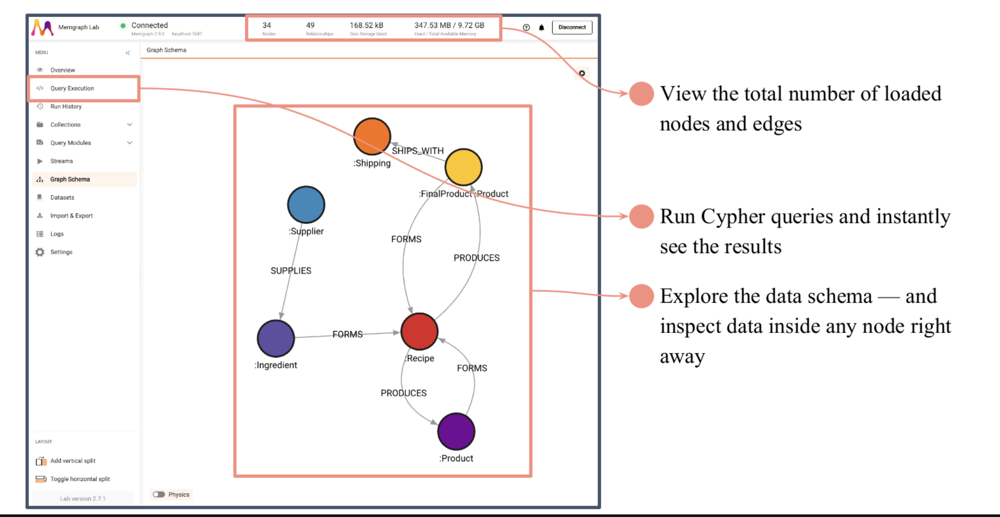

# Storage Model

Vedana uses **four** stores, each with its own area of responsibility.

| Store        | Responsibility                                                                                              |
| ------------ | ----------------------------------------------------------------------------------------------------------- |
| **Postgres** | JIMS (threads, events), Datapipe (data model, intermediate tables), pgvector (embeddings) — all in one DB.  |
| **Memgraph** | The knowledge graph (anchors, links) and text indices.                                                       |
| **pgvector** | Embeddings of embeddable attributes on nodes and edges.                                                     |
| **Grist**    | The data model and the actual domain data — the source of truth that humans edit.                          |

By default JIMS and Datapipe write into the same Postgres database (`JIMS_DB_CONN_URI` and `DB_CONN_URI` point to the same server). If you need isolation, the databases can be split.

## Postgres / JIMS

JIMS tables are defined in `jims_core.db`:

```python
class ThreadDB(Base):
    __tablename__ = "threads"
    thread_id: UUID    # PK
    contact_id: str    # indexed
    external_id: str   # nullable, indexed — id of the conversation in an external system
                       # (Chatwoot conversation id, CRM ticket id, …)
    created_at: datetime
    thread_config: JSONB

class ThreadEventDB(Base):
    __tablename__ = "thread_events"
    thread_id: UUID  # PK
    event_id: UUID   # PK
    created_at: datetime  # server_default=now()
    event_type: str       # "comm.user_message", "rag.query_processed", ...
    event_domain: str     # nullable; not populated by ThreadController
    event_name: str       # nullable; not populated by ThreadController
    event_data: JSON      # Postgres JSON (not JSONB)
```

Notes:

- `event_data` is stored as Postgres `JSON` (with a SQLite `JSON` variant for tests). See `jims_core/db.py:46`.
- `event_domain` / `event_name` exist in the schema but are not written today — only `event_type` is populated.
- `external_id` is used by `ThreadController.new_thread_via_external_id` for idempotent thread lookup from integrations (Chatwoot, etc.). Indexed but non-unique. Added by migration `2026_04_10_1200-17f7b4956ca5_jims_add_external_id`.
- `created_at` is set by the server.
- One thread = one chain of events ordered by `created_at`.

`ThreadController.make_context()` reads every `thread_events` row for a thread, filters `comm.*` into `history`, and the rest goes into `events`.

## Postgres / Datapipe

ETL stores its tables in Postgres too. See the full list in [Vedana ETL](./architecture/vedana-etl.md). In short:

- `dm_*` — the data model (anchors, links, attributes, queries, prompts, lifecycle).
- `grist_nodes`, `grist_edges` — raw data from Grist.
- `nodes`, `edges` — normalised data before loading into Memgraph.
- `memgraph_anchor_indexes`, `memgraph_link_indexes` — bookkeeping of which indexes have been created.
- `eval_gds` — the golden dataset for evaluation.

Datapipe uses these tables for **incremental** processing: only rows whose key or input changed are recomputed.

## Postgres / pgvector

The [pgvector](https://github.com/pgvector/pgvector) extension adds a `vector` type and cosine/euclidean/inner-product operators.

Tables:

```sql
CREATE TABLE rag_anchor_embeddings (
    node_id        text NOT NULL,
    node_type      text NOT NULL,
    attribute_name text NOT NULL,
    attribute_value text,
    embedding      vector(1024) NOT NULL,
    PRIMARY KEY (node_id, node_type, attribute_name)
);

CREATE TABLE rag_edge_embeddings (
    from_node_id   text NOT NULL,
    to_node_id     text NOT NULL,
    edge_label     text NOT NULL,
    attribute_name text NOT NULL,
    attribute_value text,
    embedding      vector(1024) NOT NULL,
    PRIMARY KEY (from_node_id, to_node_id, edge_label, attribute_name)
);
```

The dimension `1024` is a parameter (`EMBEDDINGS_DIM`). Changing it requires a SQL migration.

`PGVectorStore.vector_search` builds queries like:

```sql
SELECT (1 - embedding <=> :query_emb) AS similarity, ...
FROM rag_anchor_embeddings
JOIN nodes ON ...
WHERE node_type = :label AND attribute_name = :prop_name AND similarity > :threshold
ORDER BY embedding <=> :query_emb
LIMIT :top_n;
```

> `<=>` is pgvector's cosine distance operator; `1 - distance` gives the similarity.

Extension management: see [`CREATE_PGVECTOR_EXTENSION`](../getting-started/configuration.md).

## Memgraph



[Memgraph](https://memgraph.com/) is a graph database compatible with Neo4j's Bolt protocol. Vedana uses:

- **nodes** with labels (label = anchor.noun) and properties (the node's attributes);
- **edges** with a type (type = link.sentence) and properties;
- **text indices** (for full-text search via `text_search.search_all`).

Creating nodes and edges:

```cypher
MERGE (n:`Product` {id: $id}) SET n = {id: $id, name: $name, price: $price, ...} RETURN n

MATCH (nf {id: $from_id}), (nt {id: $to_id})
CREATE (nf)-[r:`PRODUCT_belongs_to_CATEGORY` {since: $since}]->(nt) RETURN r
```

In Vedana this is done by Datapipe (`pass_df_to_memgraph` via `Neo4JStore`).

Read-only Cypher is executed with `RoutingControl.READ` so you can split read/write replicas if your cluster is configured that way.

### Storage mode

In docker-compose Memgraph runs with `--storage-mode=IN_MEMORY_ANALYTICAL`. This gives high read performance because all data lives in RAM. For large datasets or strict durability requirements, switch to `IN_MEMORY_TRANSACTIONAL` or `ON_DISK_TRANSACTIONAL`.

## Grist

[Grist](https://github.com/gristlabs/grist-core) is an open-source spreadsheet+database. By default it's used as the human-friendly entry point:

- the **Data Model** doc (`GRIST_DATA_MODEL_DOC_ID`) — Anchors, Links, Anchor_attributes, Link_attributes, Queries, Prompts, ConversationLifecycle;
- the **Data** doc (`GRIST_DATA_DOC_ID`) — domain tables;
- the **Test Set** doc (`GRIST_TEST_SET_DOC_ID`) — the golden dataset.

Reading is done through `vedana_core.data_provider.GristCsvDataProvider` (Grist's CSV API) or `GristAPIDataProvider`.

You can use managed Grist (`https://api.getgrist.com`) or self-host (`gristlabs/grist`).

## Migrations

Alembic migrations responsible for the JIMS / Datapipe / pgvector schemas live in `apps/vedana/migrations/`. To run:

```bash
cd apps/vedana
uv run alembic upgrade head
```

In docker-compose this is done by a separate `db-migrate` service, which waits for `db` to be healthy and applies migrations before the main `app` starts.

## Backups and restore

> ⚠️ Vedana does **not** ship backup/restore scripts. The repo's `docker-compose.yml` carries a TODO `add complete snapshots for SQL and Cypherl (db / memgraph)`; until that lands, backups are entirely the operator's responsibility. Everything below is a **recommended scheme**, not something Vedana performs automatically.

A recommended scheme for production:

- **Postgres**: pg_dump / managed snapshot (standard practice).
- **Memgraph**: `cypherl` dumps (`SHOW SNAPSHOT` / `mgconsole --output-format cypherl`) or built-in snapshot mechanisms (see [Memgraph docs](https://memgraph.com/docs/memgraph/database-features/storage)).
- **Grist**: document export or managed backup (if Grist is managed).
- Restore: Postgres first (schema + dm_* + JIMS tables), then Memgraph, then re-run ETL to fill missing embeddings.
