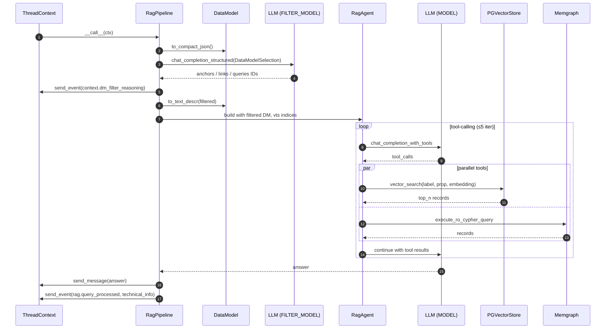

# Vedana Core

`vedana-core` is the RAG layer on top of JIMS. The main modules and their responsibilities:

| Module                          | What's inside                                                                                                  |
| ------------------------------- | --------------------------------------------------------------------------------------------------------------- |
| `vedana_core.app`               | `VedanaApp` and `make_*_app` — component factories.                                                            |
| `vedana_core.rag_pipeline`      | `RagPipeline`, `StartPipeline`, `DataModelSelection` (data model filtering).                                   |
| `vedana_core.rag_agent`         | `RagAgent` and the built-in tools `vector_text_search`, `cypher`.                                              |
| `vedana_core.llm`               | `LLM`, `Tool`, prompt templates, the tool-calling loop.                                                        |
| `vedana_core.graph`             | `Graph`, `CypherGraph`, `MemgraphGraph` — graph DB client.                                                     |
| `vedana_core.vts`               | `VectorStore`, `PGVectorStore`, `MemgraphVectorStore`.                                                         |
| `vedana_core.data_model`        | `DataModel`, `Anchor`, `Link`, `Attribute`, `Query`, `Prompt`, `ConversationLifecycleEvent` — the domain schema.|
| `vedana_core.data_provider`     | `GristAPIDataProvider`, `GristCsvDataProvider` — read data from Grist.                                          |
| `vedana_core.db`                | `get_sessionmaker()` — async SQLAlchemy.                                                                        |
| `vedana_core.settings`          | `VedanaCoreSettings` — pydantic-settings.                                                                       |
| `vedana_core.utils`             | helpers.                                                                                                         |

## `RagPipeline.process_rag_query` flow



## RagPipeline

`RagPipeline` implements the JIMS `Pipeline`:

```python
class RagPipeline:
    def __init__(
        self,
        graph: Graph,
        vts: VectorStore,
        data_model: DataModel,
        logger,
        threshold: float = 0.8,
        top_n: int = 5,
        model: str | None = None,
        filter_model: str | None = None,
        enable_filtering: bool | None = None,
    ):
        ...

    async def __call__(self, ctx: ThreadContext) -> None: ...
```

The high-level logic:

1. Get the latest user message (`ctx.get_last_user_message`).
2. Update the status (`Processing your question...`).
3. Run `process_rag_query`.
4. Send the answer to the thread (`ctx.send_message`).
5. Record a `rag.query_processed` event with all the technical information.
6. On exception — send a generic error to the user and record `rag.error` with traceback (the user never sees the stack).

### Data model filtering

If `enable_filtering=True` (the default), an additional step runs before the main agent.

The goal: shrink the main model's context by leaving only the subset of anchors / links / attributes / queries relevant to the current question.

Algorithm:

1. The compact JSON of the data model is taken (`DataModel.to_compact_json`).
2. `LLMProvider.chat_completion_structured` is invoked with `response_format = DataModelSelection`. That's a `BaseModel` with `reasoning`, `anchor_nouns`, `link_sentences`, `anchor_attribute_names`, `link_attribute_names`, `query_ids` fields.
3. The LLM provider model is temporarily switched to `FILTER_MODEL` (default `gpt-4.1-mini`), then switched back.
4. The selected IDs are resolved into query names (`dm_json["queries"].get(int(i))`).
5. `DataModel.to_text_descr(...)` renders the filtered data model into text.

A `context.dm_filter_reasoning` event with the LLM's reasoning is sent into the thread (when filtering succeeded) — it's later included in `ctx.context(...)` (see `ThreadContext.context`).

After the agent has produced its answer, a `rag.data_model_filtered` event is sent (at the end of `process_rag_query`) with full telemetry: `selected_anchors`, `selected_links`, `original_counts`, `filtered_counts`, `reasoning`.

If filtering raises, the fallback is the full data model (`DataModel.to_text_descr()` without arguments).

### Building the agent

The `RagAgent` is created with:

- `graph` — the Memgraph client;
- `vts` — the pgvector client;
- `data_model_description` — the rendered text (from the filtering step);
- `data_model_vts_indices` — the list of available vector indices in the data model (`DataModel.vector_indices()`);
- `llm` — the `LLM` wrapper over `LLMProvider`;
- `ctx` — the `ThreadContext`.

### Technical trace

After producing the answer, `RagPipeline` collects `technical_info`:

```python
{
    "vts_queries": ["vector_search('label','prop','text')", ...],
    "cypher_queries": ["MATCH ... RETURN ...", ...],
    "num_vts_queries": int,
    "num_cypher_queries": int,
    "model_used": str,
    "model_stats": {model_name: ModelUsage, ...},
}
```

All of it goes into `rag.query_processed`. The backoffice shows it under "Details" beneath the assistant's answer.

## RagAgent and tools

`RagAgent.text_to_answer_with_vts_and_cypher(text_query, threshold, top_n)`:

1. Registers two tools: `vector_text_search` (with a dynamic Enum schema based on available indices) and `cypher` (with a fixed `CypherArgs`).
2. Calls `LLM.generate_cypher_query_with_tools(data_descr, messages, tools)`.
3. Returns the final answer + the list of query events + the lists of executed VTS and Cypher queries.

### The `vector_text_search` tool

`VTSArgs` is a pydantic model with fields:

- `label` — anchor / link name; when at least one embeddable index exists in the data model, the field is constrained by an `Enum` built from `vts_indices`. With no embeddable indexes the base `VTSArgs` (free-string `label`/`property`) is used.
- `property` — field name, similarly Enum-constrained when indexes exist, otherwise a free string.
- `text` — text to search.

In code:

```python
async def vts_fn(args: VTSArgs) -> str:
    label = args.label.value if isinstance(args.label, enum.Enum) else args.label
    prop = args.property.value if isinstance(args.property, enum.Enum) else args.property

    prop_type, th = self._vts_meta_args.get(label, {}).get(prop, ("node", threshold))
    vts_queries.append(VTSQuery(label, prop, args.text))
    vts_res = await self.search_vector_text(label, prop_type, prop, args.text, threshold=th, top_n=top_n)
    return self.result_to_text(VTS_TOOL_NAME, vts_res)
```

`prop_type` is `"node"` or `"edge"` and selects which pgvector table to compute cosine distance against.

### The `cypher` tool

```python
async def cypher_fn(args: CypherArgs) -> str:
    cypher_queries.append(CypherQuery(args.query))
    res = await self.execute_cypher_query(args.query)
    return self.result_to_text(CYPHER_TOOL_NAME, res)
```

`execute_cypher_query` calls `Graph.execute_ro_cypher_query` (read-only). The result is capped at `rows_limit=30` via `itertools.islice`.

### `result_to_text`

Turns a `list[Record] | Exception` into a string. Memgraph nodes (`neo4j.graph.Node`) preserve their labels; embeddings (fields ending in `_embedding`) are stripped before serialising to JSON to keep the LLM context clean.

## LLM and the tool-calling loop

`vedana_core.llm.LLM` wraps `LLMProvider` and implements `create_completion_with_tools(messages, tools)`:

1. Run a chat completion with tools.
2. If `tool_calls` come back, execute them in parallel (`asyncio.gather`) and append the results to `messages`.
3. Repeat up to 5 iterations.
4. If the iteration limit is hit, append the finalisation prompt `finalize_answer_tmplt` and ask the model to produce the answer from the accumulated context.
5. Return the tuple `(messages, last_assistant_content)`.

If the answer is still empty, `RagAgent` runs the fallback `LLM.generate_no_answer(...)` with the `generate_no_answer_tmplt` template — generating a polite "sorry, didn't find anything, please clarify".

## Application assembly

`vedana_core.app.make_vedana_app()`:

```python
@alru_cache
async def make_vedana_app() -> VedanaApp:
    sessionmaker = get_sessionmaker()
    graph = MemgraphGraph(...)
    vts = PGVectorStore(sessionmaker=sessionmaker)
    data_model = DataModel(sessionmaker=sessionmaker)
    pipeline = RagPipeline(graph=graph, vts=vts, data_model=data_model, ...)
    start_pipeline = StartPipeline(data_model=data_model)
    return VedanaApp(...)
```

`make_jims_app()` wraps it in a `JimsApp` with `pipeline=vedana_app.pipeline` and `conversation_start_pipeline=vedana_app.start_pipeline`.

The global variable `app = make_jims_app()` is **a coroutine**; it will be awaited in the event loop when the application is loaded via `jims_core.util.load_jims_app("vedana_core.app:app")`.

## Caching

- `make_vedana_app` and `make_jims_app` are wrapped in `async_lru.alru_cache` — the application is assembled once per process.
- `LLMProvider.chat_completion_plain` supports `use_cache=True` (LiteLLM caching), but it isn't enabled in the main pipeline.

## Extension points

- **Custom `Graph`** — subclass `Graph` or `CypherGraph` and swap it in `make_vedana_app`.
- **Custom `VectorStore`** — implement `vector_search(label, prop_type, prop_name, embedding, threshold, top_n)`. Useful, for example, when moving to pinecone/weaviate.
- **Custom tool** — add `Tool(name, description, args_cls, fn)` to the `tools` list in `RagAgent.text_to_answer_with_vts_and_cypher`. See [Custom Tools](../guides/custom-tools.md).
- **Custom pipeline** — implement `Pipeline` and replace it in `JimsApp`.
- **Custom data model source** — subclass `DataModel` or override `get_anchors / get_links / get_queries`. By default they read the `dm_*` tables from Postgres.
