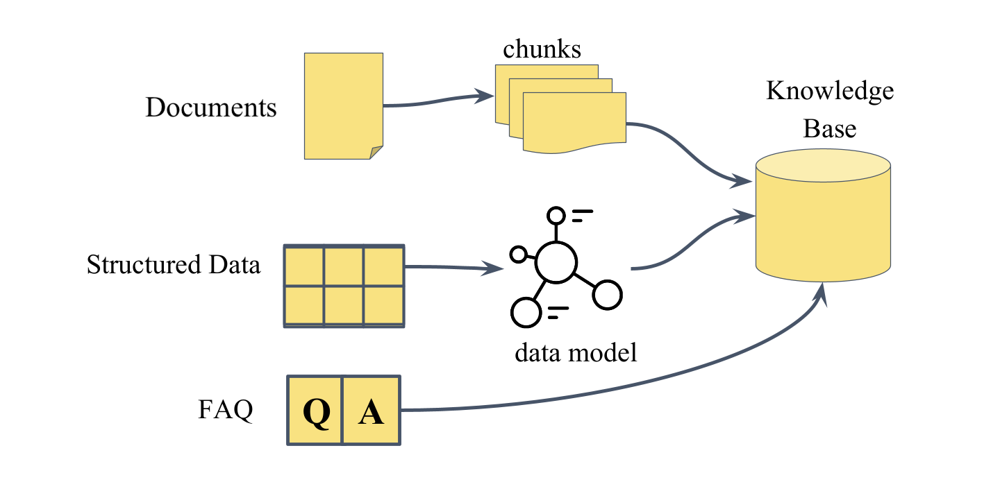

# Data for Vedana

## Core principle

Most question-answering systems work by finding text that looks similar to the question and asking a language model to produce an answer from it. Vedana works differently. It stores your domain knowledge as a **structured knowledge graph** and answers questions by **navigating that graph**: counting, filtering, traversing relationships, and tracing every answer back to its source. You always know where the answer came from.

This matters because real user questions rarely fit "find me text that looks like this". People ask for specific values, exact counts, complete lists, and answers that depend on how entities relate to each other. A system built on text similarity can approximate those answers. A system built on a structured graph can *compute* them.


> The quality of Vedana's answers is determined first by the quality of the data in the graph, and only then by the model and tools that query it. A well-designed data model with incomplete, outdated, or poorly structured data still produces wrong answers.

## How data is stored

All domain data in Vedana lives in **Memgraph** as a knowledge graph, not as a flat collection of text chunks. Data is stored as:

- **Anchors** — typed nodes (product, document, contract, branch…);
- **Links** — typed edges between nodes (relationships);
- **Attributes** — typed properties on nodes and edges.

**Embeddings** live separately — in `pgvector` in Postgres, in the `rag_anchor_embeddings` and `rag_edge_embeddings` tables. That layer is auxiliary; structure is the foundation.

This storage model is what makes deterministic retrieval possible: a Cypher query against the graph returns the same result every time, because it follows explicitly defined relationships rather than estimating similarity.

## Three types of data



Vedana supports three types of domain data, each suited to a different kind of question.

### Documents

**Documents** are unstructured text: policies, manuals, contracts, knowledge base articles. At ingestion time a document is split into chunks; each chunk becomes a node in the graph with an embedding attached. When a user asks a document-related question, the assistant retrieves the most relevant chunks by semantic similarity and assembles a response from their content.

Documents are the right choice when the answer is explanatory or contextual. They are **not** the right choice when the answer requires a specific value, a count, or a relationship traversal — those cases call for structured data.

See [Documents and Chunks](../data-ingestion/documents-and-chunks.md).

### Structured data

**Structured data** is domain knowledge expressed as typed entities with queryable attributes and explicit relationships: product catalogs, price lists, branch locations, contracts with effective dates, mappings between categories and regulatory requirements.

Each row in the source table becomes an anchor node in the graph, each column becomes an attribute, and relationships between tables become typed edges. This enables what documents can't deliver: exact filtering by value, numeric comparisons, exhaustive lists, and multi-hop traversal across related entities.

See [Structured Data](../data-ingestion/structured-data.md).

### FAQ

**FAQ** entries are predefined question-and-answer pairs stored in a dedicated Grist table and returned directly when there's a match. The simplest ingestion method, requires no modeling. Suited to short, canonical responses where consistent wording matters (business hours, return policy).

See [FAQ](../data-ingestion/faq.md).

## How retrieval works

Vedana supports two retrieval mechanisms, and the assistant picks between them based on the question type and the rules described in the playbook.

**Vector search (`vector_text_search`)** is used for document questions. The user query is embedded and matched against stored chunk embeddings. The closest matches go into the LLM, which synthesises a response from their content.

**Cypher queries** are used for structured questions. The assistant generates Cypher from the data model description, runs it on Memgraph, and gets a structured result directly from the graph. This is **exact and exhaustive**: every matching record is returned, not just the most similar ones.

For hybrid questions both mechanisms are combined: vector search retrieves candidate content from documents, and Cypher refines or filters the result through graph structure.

## How data gets into the graph

There are two ingestion paths.

| Path                   | When it fits                                                |
| ---------------------- | ------------------------------------------------------------ |
| Grist + ETL (default)  | Manual entry, mid-size data, non-engineers managing data.   |
| Custom ETL → Memgraph  | Large volumes, automated pipelines, streaming ingestion.    |

### Grist

Grist is the default interface for data entry and modeling. You fill in tables in Grist, ETL transforms them into graph structures in Memgraph:

```
Data → Grist → ETL (Datapipe) → Memgraph + pgvector
```

### Custom ETL

Custom ETL writes directly to Memgraph and is appropriate for large volumes, automated pipelines, or data that originates in external systems. Custom ETL bypasses Grist as the entry point, **but not the data model**: any pipeline writing to Memgraph must conform to the anchor / attribute / link schema described in Grist.

See [Custom ETL](../data-ingestion/custom-etl.md).

## What's next

- [Data Model for Vedana](./concepts/data-model-for-vedana.md) — what the data model is and why you need it.
- [Setting Up Data Model](../guides/setting-up-data-model.md) — how to describe your domain.
