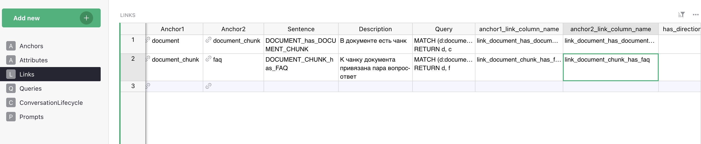

# Data Model for Vedana

## What the Data Model is and why it exists

The Data Model is a structured description of your domain that helps the assistant understand and work with your data unambiguously. The key idea of Vedana: the assistant doesn't guess answers from text similarity. Instead, it uses a clear data structure to build accurate, logic-based answers.

The data model describes:

- which entities exist in the system;
- what attributes they have;
- how entities relate to each other.

It is the contract between:

- domain knowledge;
- storage (the graph);
- tools;
- LLM reasoning.

> If you want the LLM to reason about something, that something must first be described in the data model.
> **No structure → no deterministic reasoning.**

Understanding the data model means understanding Vedana.

## Data model structure

The data model follows the [Minimal Modeling](https://www.minimalmodeling.com/) approach and consists of **three required tables**:

- **Anchors** — domain entities (Product, Document, Category, …);
- **Attributes** — properties of those entities (name, code, description, price, …);
- **Links** — relationships between entities (Product → belongs_to → Category, …).

These three tables are the minimum you need for the assistant to work with the graph.

In addition there are optional tables:

- **Queries** — the playbook, instructions for the LLM about typical questions;
- **Prompts** — customisable system prompt templates;
- **ConversationLifecycle** — responses to lifecycle events of the conversation (`/start`, etc.).

## Default Data Model

Vedana ships with a minimal working data model that supports RAG behaviour out of the box. Three anchor types are pre-defined: `documents`, `document_chunks`, `faq`. That's enough for Vedana to retrieve relevant document chunks, run vector search, answer from FAQ, and return grounded answers with sources.

This covers the basic "document Q&A" scenario. For everything else, the model needs to be extended.

## What needs to be described in the data model

### 1. Anchors (nodes)

Anchors are domain entity types. Each row in the Anchors table describes a single entity type.

| Field           | What it contains                                                  |
| --------------- | ----------------------------------------------------------------- |
| **noun**        | entity name (English, singular, unique)                           |
| **description** | human-readable description, included in the LLM context           |
| **id_example**  | a real example of a primary key                                    |
| **query**       | the Cypher query used to retrieve entities of this type            |

`description` is the main channel through which the LLM understands *when* to use this anchor. `"Represents a product"` tells the assistant almost nothing. `"A sellable product in the catalog with a price, availability status, and category. Use this anchor to answer questions about specific products, prices, and stock levels"` gives it enough context to make correct decisions.

See [Anchors](../data-model/anchors.md).

### 2. Attributes

Attributes are typed properties of anchors. In Grist they live in two tables:

- **Anchor_attributes** — properties of nodes;
- **Link_attributes** — properties of edges.

Both have the **same column structure**; the difference is only in what they're attached to.

| Field               | Description                                                                                       |
| ------------------- | -------------------------------------------------------------------------------------------------- |
| **attribute_name**  | system name of the attribute                                                                        |
| **anchor / link**   | the owner of the attribute                                                                           |
| **description**     | human-readable description (goes into the LLM context)                                              |
| **data_example**    | example value                                                                                        |
| **embeddable**      | whether to build an embedding for this attribute                                                    |
| **embed_threshold** | similarity threshold for semantic search (0..1)                                                     |
| **query**           | Cypher to fetch this attribute                                                                       |
| **dtype**           | data type (`str`, `int`, `float`, `bool`, `date`, `url`, `file`, …)                                  |

Use `embeddable=true` for human-readable text fields (names, descriptions, titles). Use `false` for identifiers, numeric values, and boolean flags.

See [Attributes](../data-model/attributes.md).

### 3. Links (relationships)

Links describe relationships between anchors. They turn isolated nodes into a graph.

| Field                          | Description                                                |
| ------------------------------ | ----------------------------------------------------------- |
| **anchor1 / anchor2**          | the entities the link connects                              |
| **sentence**                   | the edge label in the graph (e.g. `PERSON_has_INTEREST`)    |
| **description**                | plain-text explanation                                       |
| **query**                      | Cypher to traverse the link                                  |
| **anchor1_link_column_name**   | FK column on the anchor1 side (if any)                      |
| **anchor2_link_column_name**   | FK column on the anchor2 side                                |
| **has_direction**              | whether the link is directional (optional)                   |

See [Links](../data-model/links.md).

### 4. Queries (playbook)

The **Queries** table describes named retrieval strategies for specific question types.

- **query_name** — the question pattern (`Who likes <interest>?`).
- **query_example** — a step-by-step instruction: which tool to call first, with what parameters, what to do with the result, which tool to call next.

`query_example` must be **concrete and step-by-step**, not an abstract description. See [Queries / Playbook](../data-model/queries.md).

### 5. Prompts

Stores prompt templates the system uses for various tasks. Template names match keys in the code:

- `generate_answer_with_tools_tmplt` — the main system prompt for the agent.
- `dm_filter_prompt`, `dm_filter_user_prompt` — prompts for the data model filtering step.
- `finalize_answer_tmplt` — the finalization prompt after the tool-calling loop is exhausted.
- `generate_no_answer_tmplt` — the prompt for the "nothing found" case.
- `dm_descr_template`, `dm_anchor_descr_template`, `dm_link_descr_template`, `dm_attr_descr_template`, `dm_link_attr_descr_template`, `dm_query_descr_template` — templates that render the data model into text for the LLM.

See [Prompts](../data-model/prompts.md).

### 6. ConversationLifecycle

Messages tied to the conversation lifecycle: response to `/start`, etc.

- **event** — the event name.
- **text** — the message or instruction.

See [ConversationLifecycle](../data-model/conversation-lifecycle.md).

## Where the data model lives

By default the data model lives in **Grist > Data Model**. The document contains the tables:

| Table                    | Purpose                                                              |
| ------------------------ | --------------------------------------------------------------------- |
| `Anchors`                | entity types                                                          |
| `Anchor_attributes`      | properties of nodes                                                   |
| `Links`                  | relationship types                                                    |
| `Link_attributes`        | properties of edges                                                   |
| `Queries`                | playbook of typical questions                                         |
| `Prompts`                | prompt templates                                                       |
| `ConversationLifecycle`  | responses to lifecycle events (`/start`)                              |

The data model is loaded from Grist into Postgres through ETL and read at runtime by the `DataModel` class (`libs/vedana-core/src/vedana_core/data_model.py`). If you wish, Grist can be replaced with any other source — see [Custom ETL](../data-ingestion/custom-etl.md).

### Important note

The data model must **fully** represent every column and attribute of your source data. If the assistant gives incomplete or wrong answers, the first thing to check is whether the relevant attributes and relationships are described in the model.

## How the LLM uses the data model

The data model goes directly into the LLM context. The assistant sees:

- the list of anchor types and their descriptions;
- the attributes of each anchor with types and descriptions;
- the links between anchors;
- the scenarios (Queries) for typical questions.

If something isn't described in the data model — it **doesn't exist** for the assistant, even if the data is in the graph.

### Data model filtering

For non-trivial domains the full data model description can be large — dozens of anchor types, hundreds of attributes, several Query scenarios — and feeding all of it into the main model on every turn is both expensive and noisy.

To handle this, Vedana adds a **data model filtering** step in front of the main answer-generation loop:

1. A small, fast model (`FILTER_MODEL`, by default `gpt-4.1-mini`) receives the user's question together with the full data model description.
2. It picks the subset of **anchors, links, attributes, and Queries** that are actually relevant to the question.
3. Only that filtered slice goes into the main model's context.

This filtering step has two useful side effects:

- **Token economy on large data models.** The bigger your domain, the larger the win — filtering is what makes Vedana practical on data models with hundreds of attributes. On very small data models (e.g. the LIMIT test dataset) the gain is negligible, and you can disable filtering via `ENABLE_DM_FILTERING=false`.
- **Explicit reasoning before the answer.** Because the filter model has to *name* which anchors / links / queries are relevant, it effectively performs a small chain-of-thought step about the question before any retrieval happens. The main model then starts with a clearly-scoped problem rather than the entire schema.

See [`RagPipeline.filter_data_model`](../architecture/vedana-core.md#data-model-filtering) for the implementation, and the `FILTER_MODEL` / `ENABLE_DM_FILTERING` entries in the [Configuration guide](../getting-started/configuration.md) for tuning.

## Minimum vs advanced usage

In its minimal form (default model + documents only), Vedana behaves like an advanced RAG: document retrieval with vector search and grounded answers.

When the model is extended with structured entities, Vedana becomes a domain knowledge engine with deterministic graph traversal, attribute filtering, multi-hop reasoning, and hybrid retrieval.

The difference is entirely determined by how thoroughly you've modeled your domain.
