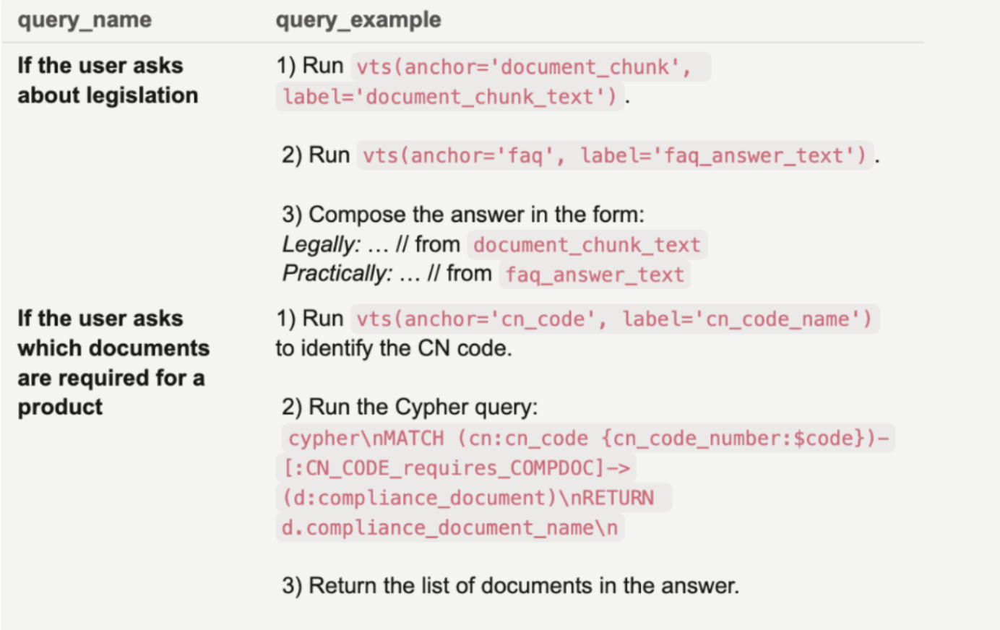

# Playbook

## What a playbook is

If the data model describes **what exists**, the playbook describes **how to react**. It's the behavioural configuration of Vedana: which intents the assistant recognises, which tools it calls and in what order, how it shapes and constrains its answers.

The playbook makes the agent predictable. Without one the LLM may pick a sub-optimal tool, mix retrieval strategies, or give too generic an answer. With one, behaviour becomes structured, constrained, and auditable.

## Where the playbook lives

The playbook lives in **Grist > Data Model > Queries**. It's part of the configuration and is loaded at runtime on every request through `DataModel.get_queries()`.

Because the playbook is data in Grist:

- you can change it without redeploying code;
- it is versionable through Grist's mechanisms;
- it is environment-specific (you can keep separate Grist documents for dev and prod).

Changes take effect right after the data model is reloaded.

## Structure

Each row in the Queries table is one intent. Fields:

- **query_name** — a short name or pattern for the question (`Who likes <interest>?`, `Give product information`).
- **query_example** — a step-by-step instruction: which tool to call first, with what parameters, what to do with the result, which tool to call next.

## Intent-based behaviour

The playbook defines how Vedana reacts to different intents.

Example intents:

- "Give product information"
- "Give delivery information"
- "Find branch address"
- "Explain policy"

Each intent may need its own retrieval strategy:

- **Product information** — structured data; the playbook tells the assistant to prefer Cypher: query the `Product` anchor, filter by name or SKU, traverse related attributes. Vector search is a fallback only.
- **Delivery information** — usually lives in text documents; the playbook routes to vector search over document chunks, retrieving the relevant policy sections and shaping the answer from them.

### Example: product information

Intent: "Give information about a product"

Playbook behaviour:

- prefer the Cypher tool;
- query the `Product` anchor;
- filter by name or SKU;
- traverse related attributes;
- use vector search only as a fallback.

Why: product information is structured; Cypher gives deterministic results.

### Example: delivery information

Intent: "Give delivery information"

Behaviour:

- use vector search;
- search `document_chunks`;
- retrieve relevant policy sections;
- shape the answer from the retrieved chunks.

Why: delivery details are usually in text documents; vector search is appropriate.

## What the playbook controls

**Tool selection.** You can specify that an intent always uses Cypher, or prefers vector search, or applies a hybrid scheme, or never answers without tool results. This removes random tool choice.

**Response instructions.** You can describe what each answer should contain for each intent: price and availability for product queries, address and phone for location queries, cited document chunks for policy queries. Answers become consistent and domain-specific instead of generic.

**Behavioural constraints.** The playbook is a guardrail. It prevents the assistant from improvising where things should be deterministic.

## Relationship to the data model

- The data model describes **what can be queried**.
- The playbook describes **how it should be queried**.

Together they fully specify runtime behaviour: one defines the structure of the domain, the other the rules for navigating it.

## How to add a new scenario



1. Open **Grist > Data Model > Queries**.
2. Create a row:
   - `query_name` — the type of question.
   - `query_example` — the step-by-step instruction for the assistant.
3. In the backoffice → ETL, refresh the data model (run `data_model_steps`).

Example `query_example`:

```
1) Use vector_text_search to get the interest node:
vector_text_search(on="node", label="interest", property="interest_name", text='<interest>')
retrieve "node_id"

2) Use Cypher to get all persons connected via PERSON_has_INTEREST:
MATCH (p:person)-[:PERSON_has_INTEREST]->(i:interest)
WHERE i.id=$node_id
RETURN p.person_name, i.interest_name
```

**Structure of a good scenario:**

- **When to apply** — describe the use case (document questions, product compatibility checks).
- **Search strategy** — vector → Cypher, Cypher → vector, or a combination.
- **Answer construction** — how exactly the final answer is built.

The more precise the steps, the more stable the assistant's behaviour.
