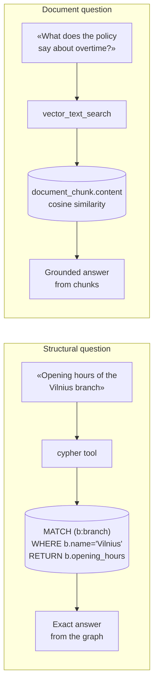

# Tools for Vedana

## Why tools exist

Vedana **doesn't let** the LLM generate answers freely from text. The assistant works through explicit tools — functions it can call to:

- inspect what's in the graph;
- retrieve data;
- assemble an answer grounded in real system data.

The LLM in Vedana is an agent. It receives a question, decides which tool is appropriate, executes it, and uses the result to form an answer. It doesn't guess — it **looks things up**.

If the first result is insufficient, the agent can keep exploring (call additional tools or refine its approach) until it has what it needs or hits the iteration limit (default 5, see `LLM.create_completion_with_tools`).

What the agent **cannot** do:

- invent a tool that doesn't exist;
- bypass restrictions defined in the playbook;
- access data outside the declared data model.

This is by design — it's what makes the system predictable, auditable, and safe to deploy in production.

## Built-in tools

Vedana ships with two core tools out of the box: `vector_text_search` and `cypher` (see `libs/vedana-core/src/vedana_core/rag_agent.py`).

## When to use which tool



### 1. Vector Search

`vector_text_search` handles **semantic retrieval over text**. It works by embedding the user query and finding the nearest matching content stored in pgvector — document chunks, FAQ entries, or other embeddable fields.

Suited to questions where the answer lives somewhere in text and needs to be found by meaning rather than exact match. Handles natural language well, tolerates phrasing variations.

Arguments (see `VTSArgs` in code):

- `label` — anchor / link name to search;
- `property` — the specific attribute (must be `embeddable=true`);
- `text` — text to search similarity against.

Technically `label` and `property` are constrained via an `Enum` schema built from the data model's available vector indices. The LLM can't ask to search a field that doesn't exist.

How it works:

1. Embeddings are already stored in pgvector (populated by the ETL pipeline).
2. The query text is embedded by the `EMBEDDINGS_MODEL`.
3. Cosine similarity > threshold → top_n results.
4. A list of objects with `similarity` and node/edge attributes is returned.

**Example (from a real playbook):**

```
vector_text_search(label="interest", property="interest_name", text="quokkas")
```

**Where it doesn't work.** Vector search doesn't understand structure or relationships. It can't reliably traverse the graph, count entities, apply strict filters, or follow multiple hops. For that you need Cypher.

### 2. Cypher

`cypher` handles **structured graph queries**. On call, the LLM generates a Cypher query based on the user's question and the data model description, runs it against Memgraph, and gets a structured result.

Cypher operates only on what is **explicitly modeled** — anchors, attributes, links. It does not approximate or infer. If you ask how many products are in category X, it **counts** them. If you ask which branches stock product Y, it walks the relationship and returns **all** matches.

Arguments:

- `query` — Cypher query.

The query is executed in read-only mode (`execute_ro_cypher_query`); the result is limited to 30 rows (`rows_limit`).

**Example:**

```cypher
MATCH (p:Product)-[:OFFER_belongs_to_CATEGORY]->(c:Category)
WHERE c.category_name = "Embedded lighting"
RETURN p
LIMIT 30
```

**When you need it:**

- attribute filtering (`WHERE price < 500`);
- relationship traversal (`MATCH (a)-[:LINK]->(b)`);
- deterministic domain queries;
- multi-hop graph exploration.

## Tool selection

The assistant picks tools dynamically based on:

- the question type;
- the available anchor types;
- the data model structure;
- the playbook (Queries) instructions.

It can pick **vector search**, **cypher**, or **a combination of both**.

**Example 1.** "What are the opening hours of the Moscow branch?" → Cypher (structured lookup on `Branch.opening_hours`).

**Example 2.** "What does the policy say about overtime?" → vector search over document chunks.

**Hybrid scenario:**

1. Vector search finds candidate chunks of the document.
2. Cypher narrows the result through graph structure.
3. The LLM assembles the final answer.

## Extending tools

Tools are extensible. If your domain needs capabilities beyond Cypher and vector search, you can implement a custom tool:

- external API queries;
- calculations;
- ERP integrations;
- domain logic.

A custom tool must:

- have a clear input/output schema (`pydantic.BaseModel` for arguments);
- be deterministic;
- be registered with the agent.

See [Writing a Custom Tool](../guides/custom-tools.md).

## The determinism boundary

Tools are deterministic. The LLM is probabilistic.

This separation is the point: the correctness of an answer in Vedana follows from the tools — from what's actually in the graph and what the query actually returns. The LLM's job is to pick the right tool and format the result in readable language. **The LLM doesn't define what's true. The data does.**

As long as tool results are stable and the data model is well-defined, the structural correctness of answers is stable too.
