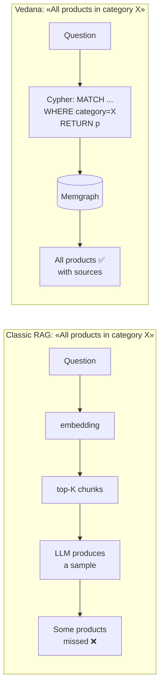

# Why Classic RAG Fails

Before diving into Vedana's architecture, it's important to understand exactly where classic RAG breaks down.

## What classic RAG is

Classic RAG connects an LLM to documents with a simple flow:

```
Chunks → Embeddings → Top-K → LLM → Answer
```



This works well when the answer fits in a few text fragments.

### Where it works

Classic RAG is effective for:

- summarization;
- simple factual questions;
- searching a small document set;
- approximate answers.

If the answer lives in one or two paragraphs, RAG is usually enough.

## Where it breaks

The trouble starts when a query requires **completeness**, **structure**, or **logic**.

### 1. Aggregations ("how many?")

RAG can't count over a dataset — it guesses based on the top-K results. An answer to "How many of our contracts expire this quarter?" computed from top-K is close to the truth but not the actual number.

### 2. Exhaustive queries ("show me all")

RAG returns a sample, not the full set. Missed items are invisible. "All documents that regulate category X" — top-K never guarantees this is *all* of them.

### 3. Relationship queries

Questions that require joins, graph traversal, or compatibility checks can't be answered reliably through vector similarity. "Which documents regulate products in category X" — that needs traversing the edges `Product → belongs_to → Category → regulated_by → Document`.

### 4. Domain logic

RAG doesn't execute rules. It predicts answer-shaped text. Any business validation ("can product A be sold together with product B to client C?") falls apart.

## The root cause

The LLM doesn't build a structured model of the domain. It works with text patterns, not with data or logic.

As a result:

- no consistency guarantees;
- no way to enforce rules;
- no reliable system reasoning.

Classic RAG amplifies these limitations by asking the model to reason on top of incomplete text fragments.

## What this means in practice

These failures are structural. They can't be fixed by:

- better embeddings;
- larger context windows;
- raising top-K.

Reliable answers need:

- access to **full data** (not a sample);
- **structured queries** (not similarity);
- **explicit relationships**;
- **executable logic**.

Fluency is not correctness.

## Why Vedana exists

Reliable AI requires more than text retrieval. It requires a system that can:

- query structured data;
- execute logic;
- guarantee completeness;
- attach a source to every answer.

That's the problem Vedana is built to solve.
