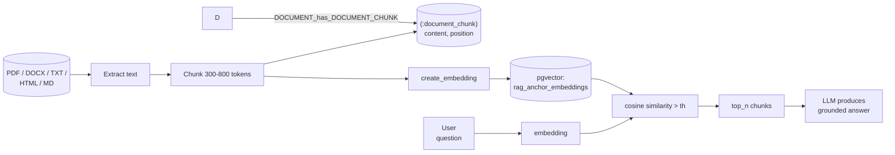

# Documents and Chunks

## What document ingestion does

Vedana can make any text-based document searchable and usable in answers. The mechanism is straightforward:

1. The document is split into chunks.
2. Each chunk is stored as a node in the graph.
3. Each chunk gets an embedding so it can be retrieved by meaning.

When a user asks a question, Vedana searches the chunk embeddings for content matching the question's intent, retrieves the most relevant pieces, and assembles a grounded answer from them. The assistant uses **only what was actually retrieved** — it doesn't make things up.

Suited to **explanatory content**: policies, manuals, contracts, knowledge base articles. **Not** suited when the answer requires precise filtering, counting, or traversal — those cases call for structured data.

## What files can be ingested

> **Important: Vedana does not extract text from binary documents automatically.** The chunking and embedding pipeline operates on **plain text only**. If you put a PDF or DOCX file straight into Grist (or your custom source), it will be stored as a binary blob and **nothing useful** will be ingested. You must extract the text yourself before loading — Vedana ingests the resulting text, not the original file.
>
> Recommended pre-processing tools (run before loading into Grist or your data source):
>
> - **PDF** — `pdftotext` (poppler), `pymupdf`, `unstructured`, or a managed service (Mathpix, Azure Document Intelligence) for scans / complex layouts.
> - **DOCX** — `python-docx`, `mammoth`, or `pandoc` to convert to Markdown.
> - **HTML** — `trafilatura` or `readability-lxml` to strip boilerplate.
> - **Scans / images** — OCR (Tesseract, AWS Textract, Azure Document Intelligence) before any of the above.
>
> Extending Vedana with an automatic extractor (PDF/DOCX → text inside the ETL) is straightforward via [Custom ETL](./custom-etl.md) — but it's not done out of the box.

Once you have plain text, any of these formats can be loaded:

- PDF (after `pdftotext` or similar)
- DOCX (after `python-docx` / `pandoc`)
- TXT
- Markdown
- HTML (cleaned)
- Google Docs (export to text/Markdown)
- CSV (as text)

**Not supported even after pre-processing without extra work:** images, audio, video — they need to be transcribed or OCR'd first.

The format matters less than the **quality of the extraction**. Garbled characters, broken sentences, merged columns → bad chunks → bad answers. Review the extracted text before uploading.

## How chunking works

A **chunk** is a contiguous excerpt of document text stored as its own node in the graph. Each chunk is linked back to the parent document so the assistant can always say which document a retrieved passage came from.

Chunk size affects retrieval quality in both directions:

- **too small** loses context;
- **too large** dilutes the semantic signal.

A common rule of thumb: **300–800 tokens per chunk** for most document types.

For documents where meaning depends heavily on continuity across paragraphs (long policies, multi-section contracts), it helps to add **overlap** between adjacent chunks — they share some text so any retrieved chunk remains understandable on its own.

## Recommended model for documents

The convention Vedana documents (and the test fixtures) follow is:

- anchor `document` — the parent document (id, title, url, source);
- anchor `document_chunk` — a chunk (id, content, position);
- link between them — `DOCUMENT_has_DOCUMENT_CHUNK` (recommended), with `anchor1 = document` and `anchor2 = document_chunk`. The link name itself is your choice — Vedana doesn't special-case it — but pick one form (e.g. `ANCHOR1_verb_ANCHOR2`) and reuse it everywhere you reference the link in Cypher;
- attribute `document_chunk.content` — `embeddable=true`, with `embed_threshold` set explicitly (recommended starting point ≈ 0.55–0.65 for chunk content; do not leave the cell empty — `DataModel` falls back to `1.0` which never matches).

> **Not built-in:** Vedana does **not** seed these anchors/links into your Grist Data Model automatically. You declare them yourself the first time you ingest documents. There is also **no chunking step in the default ETL** — `prepare_nodes` is a no-op pass-through (`vedana_etl/steps.py`: `return grist_nodes_df.copy()`). You either chunk the text before uploading to Grist, or add a custom chunking step via [Custom ETL](./custom-etl.md). The "300–800 tokens" figure earlier in this page is a recommended target for your own pre-processing, not a built-in default.

## How the assistant uses chunks at runtime

When a user asks a document-related question:

1. The assistant detects that it's a document question and picks `vector_text_search`.
2. The query is embedded and matched against stored chunk embeddings.
3. The top-N (default 5) most relevant chunks are returned.
4. The chunks go to the LLM, which assembles the response.
5. If the playbook is configured to include source IDs or document titles, they appear in the answer.

The assistant **doesn't read entire documents**. It reads the chunks that were retrieved. So chunking quality and retrieval relevance directly determine the answer's quality.

## Relationship to the rest of the data model

Documents and chunks are a specific kind of anchor in the graph. They follow the same rules as any other anchors: they must be described in the data model, they're created during ETL, and their behaviour at query time is governed by the playbook.

See [Data for Vedana](../concepts/data-for-vedana.md) for the broader picture.

## What's next

- [Adding Documents guide](../guides/adding-documents.md) — step-by-step instructions.
- [Structured Data](./data-ingestion/structured-data.md) — when documents aren't enough.
- [FAQ](./data-ingestion/faq.md) — for short canonical answers.
