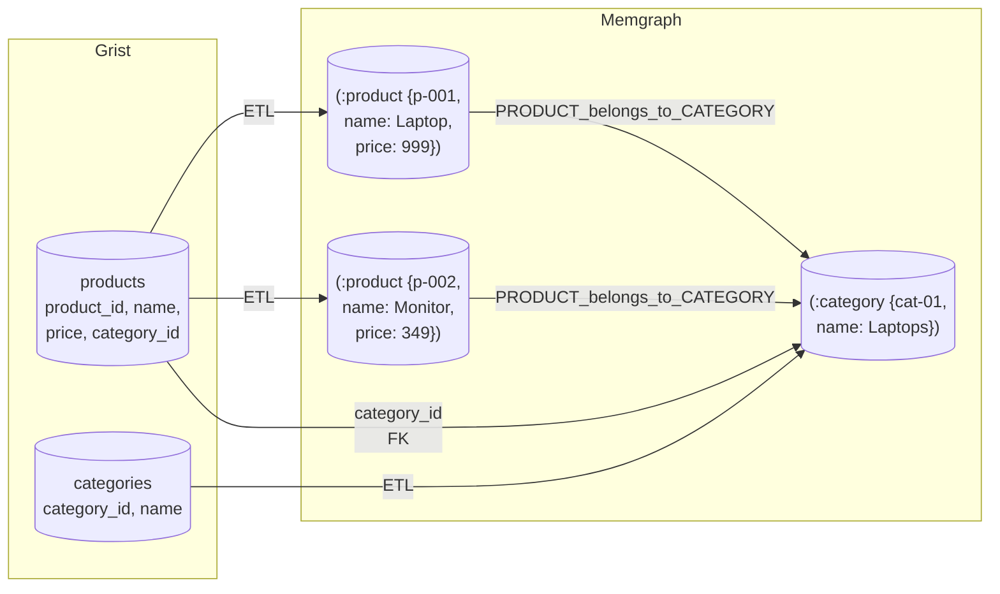

# Structured Data

## What it is

Structured data is domain knowledge expressed as typed entities with queryable attributes and explicit relationships. Instead of storing information as text to search by meaning, it's stored as nodes in the graph with specific typed properties (numbers, strings, dates, booleans) — they can be filtered, compared, and traversed **exactly**.

A product catalog, a list of branch locations, a table of contracts with start and end dates, a mapping between categories and regulatory requirements — all of that is structured data. Each row of the source table becomes an anchor node in the graph, each column becomes an attribute, and relationships between tables become typed edges.

## When to use structured data

The clearest signal that data should be structured rather than stored as documents is **the nature of the questions** users will ask. If the correct answer is a specific value (a number, a date, a name, a yes or no), the data should be structured.

Questions that need structured data:

- "Which products cost less than 500?"
- "What time does the Vilnius branch close on Sunday?"
- "Which contracts expire this month?"
- "Which requirements apply to this product category?"

None of these can be answered reliably through text similarity. Vector search might find a paragraph that mentions a price, but it can't filter every product below a threshold, return a complete list, or guarantee the answer is current and exact. These questions need a **query**, not similarity.

A rule of thumb: if you'd normally answer such a question by **opening Excel and applying a filter**, the data should be structured.

## How tables become a graph

At ingestion, each source table is **mapped** to the data model before ETL runs. The mapping defines three things per table:

- which anchor type it represents;
- which columns become attributes;
- which columns represent relationships and should become edges.

### Example: products

|product_id|name|price|category_id|
|---|---|---|---|
|p-001|Laptop|999.00|cat-01|
|p-002|Monitor|349.00|cat-01|



The mapping declares:

- **Anchor type:** `product`
- **Attributes:** `name` (str), `price` (float)
- **Link:** `category_id` → `PRODUCT_belongs_to_CATEGORY` → anchor `category`

After ETL the graph looks like:

```
(:product {product_id: "p-001", name: "Laptop",  price: 999.00})
(:product {product_id: "p-002", name: "Monitor", price: 349.00})
(:category {category_id: "cat-01", ...})

(p-001) -[:PRODUCT_belongs_to_CATEGORY]-> (cat-01)
(p-002) -[:PRODUCT_belongs_to_CATEGORY]-> (cat-01)
```

Vedana now answers "Which products cost less than 500?" via Cypher:

```cypher
MATCH (p:product) WHERE p.price < 500 RETURN p.name, p.price ORDER BY p.price
```

— returning **all** records that satisfy the condition, not a sample.

## Combining structured data and documents

Structured data and documents are not alternatives — they're complementary, and the most effective deployments use both. Each does what the other can't.

Take a contract:

- the full contract text → document chunks (vector search): "What does the termination clause say?"
- key fields (contract_id, start_date, end_date, counterparty) → a structured anchor `contract`: "When does contract C-123 expire?"

```
(:contract {contract_id: "c-001", start_date: 2024-01-01, end_date: 2025-12-31, counterparty: "Acme Ltd"})
   |
   |--has_chunk--> (:document_chunk {content: "Scope of work..."})
   |--has_chunk--> (:document_chunk {content: "Payment terms..."})
   |--has_chunk--> (:document_chunk {content: "Termination clause..."})
```

The same object becomes queryable in **two ways** — for two different question types.

This is the recommended strategy for any content that has both factual attributes and explanatory text.

## What a properly modelled structured layer enables

Vedana can:

- filter by exact attribute values — price, date, status, category;
- return exhaustive lists — every product in a category, every contract expiring this quarter;
- do multi-hop traversal — which legal documents regulate products of category X (via `Product → belongs_to → Category → regulated_by → Document`);
- combine structured filters with document retrieval in a single answer.

None of that is possible with chunks alone. Chunks are the right tool for finding meaning in text. Structured anchors are the right tool for reasoning over a domain.

## What's next

- [Adding Structured Data guide](../guides/adding-structured-data.md) — step by step.
- [Data Model: Anchors](../data-model/anchors.md) and [Links](../data-model/links.md) — describe the schema.
