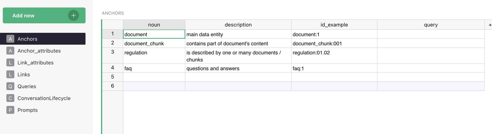
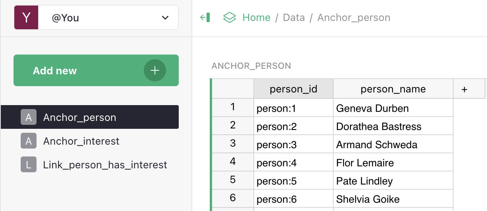
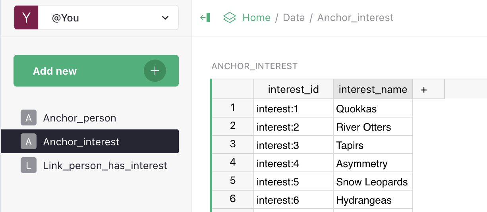

# Anchors (nodes)

An **anchor** is a domain entity type. Every class of objects the assistant can look up, filter, count, or traverse is described as an anchor.

In Memgraph each anchor corresponds to a class of nodes whose label equals `anchor.noun` **literally** (no case conversion). When you define a `product` anchor and run ETL, every row in your products table in Grist becomes a `:product` node with its columns stored as properties. Pick any naming style you like (`product` / `Product` / `products` — all work); the only hard rule is that the label is what `MATCH (n:<label>)` will be looking for, so be consistent across Anchors, Links and Queries. The Cypher examples below use lowercase singular (`product`, `interest`, `document_chunk`) because that's how the test dataset and most of our examples happen to be written — not because the engine enforces it.

> An anchor is the **schema**, not data. The Anchors table in Grist describes *what kinds of things exist*, not the things themselves.

## Fields

| Field           | Type   | Description                                                                                                                          |
| --------------- | ------ | ------------------------------------------------------------------------------------------------------------------------------------- |
| **noun**        | str    | Entity name. Becomes the label in Memgraph **literally** (no case conversion). The data table for this anchor in the Grist Data doc must be named `Anchor_<noun>` (e.g. `noun = "person"` ↔ table `Anchor_person`) — ETL discovers data tables by prefix; see [Naming conventions](../architecture/vedana-etl.md#naming-conventions-in-grist). Latin script and uniqueness across the table are required; singular vs. plural and case are your choice — pick a style and stay consistent. PK of the table. |
| **description** | str    | Human-readable description. Goes into the LLM context. The more precise — the better the assistant picks the anchor.               |
| **id_example**  | str    | A real example of a primary key (`product_id: "p-001"`). Helps the ETL and the LLM understand the format.                            |
| **query**       | str    | Cypher query to retrieve entities of this type. Without it, detail retrieval is unreliable — the assistant falls back to less precise methods. |

## What you get in the graph



One row in Anchors + the corresponding rows of data = a graph like:

```
(:product {id: "p-001", name: "Laptop", price: 999.00})
(:product {id: "p-002", name: "Monitor", price: 349.00})
```

The label (`product`) comes from `anchor.noun`. The properties come from data rows. The label is what allows Cypher to find nodes of this specific type: `MATCH (p:product) RETURN p`.

## Examples from the test dataset (LIMIT)





## How the description affects the assistant

The full list of anchors with their descriptions goes into the system prompt. This lets the LLM:

- understand which entity type a question is about;
- generate correct Cypher with the right node labels;
- pick the right retrieval tool (structured query or vector search);
- speak the language of the domain instead of guessing.

If anchors are described poorly (vague descriptions, inconsistent names, missing PKs), the assistant can't reason correctly. The quality of anchor descriptions is one of the highest-leverage things you can control.

## Anchors vs data vs documents

- An anchor is a **type**, not a row. Analogy: `CREATE TABLE`, not `INSERT INTO`.
- `document` / `document_chunk` / `faq` are anchors that the [Documents and Chunks](../data-ingestion/documents-and-chunks.md) and [FAQ](../data-ingestion/faq.md) workflows expect you to declare in your Grist Data Model. They are a **recommended starter set** — almost every real project has documents, chunks of those documents, and a list of common Q&A — so we suggest adding them straight into your data model. There's no magic: nothing is seeded into Grist automatically, and no code path special-cases these names. Most anchors you'll create yourself are **structured** domain entities: products, contracts, branches, employees, whatever your domain requires.

## Examples

### E-commerce
- `product` — a product in the catalog.
- `category` — a catalog category.
- `brand` — a brand.
- `branch` — a branch / store.
- `warehouse` — a warehouse.

### Legal/compliance
- `contract` — a contract.
- `counterparty` — a counterparty.
- `requirement` — a regulatory requirement.
- `legal_document` — a regulatory document.

### HR / org structure
- `person` — an employee.
- `department` — a department.
- `role` — a role.
- `project` — a project.

## Checklist before adding an anchor

- [ ] Name is Latin script, unique across the table. Pick singular or plural — just be consistent across Anchors, Links and Queries.
- [ ] Description explains what it is and when to use (not "represents X").
- [ ] `id_example` is a real example of a key from your table.
- [ ] `query` is a working Cypher query — paste it into Memgraph Lab and verify a result.
- [ ] You've thought about what links to other anchors are needed.
- [ ] You've thought about which attributes are embeddable and which aren't.

## Common mistakes

- **Non-Latin name.** Breaks queries and Cypher (Memgraph's Bolt driver doesn't always handle non-ASCII identifiers gracefully).
- **Description that just repeats the name.** "Product is a product" — useless to the LLM.
- **No `query`.** The assistant will have to guess via vector search — bad for precise queries.
- **An anchor where an attribute would do.** If `category` has no own properties or links, keep it as a `string` attribute, not a separate anchor. See [Attributes vs Links](./data-model/attributes.md#attribute-vs-link).
- **Two anchors that differ only by case or number.** `product` and `Product`, `branch` and `branches` — these are **different labels** in Memgraph and Cypher won't unify them. Pick one form and stick to it.

## What's next

- [Attributes](./data-model/attributes.md) — properties of anchors.
- [Links](./data-model/links.md) — relationships between anchors.
- [Adding Anchors guide](../guides/adding-anchors.md) — step-by-step.
