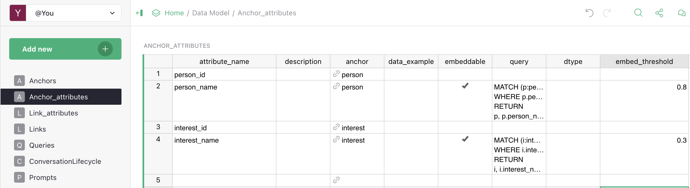
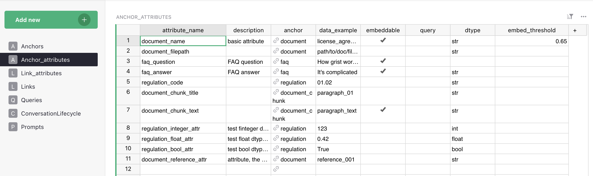
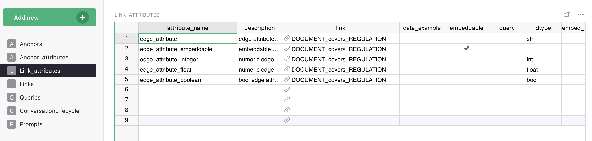

# Attributes

An **attribute** is a typed property attached to an anchor (or link). If anchors describe *what exists*, attributes describe *what we know about it* — the specific, queryable data that describes each entity.

For a `Product` anchor attributes might be: `name` (string), `price` (float), `currency` (string), `in_stock` (bool). For `Branch`: `address`, `city`, `opening_hours`. For `Contract`: `start_date`, `end_date`, `counterparty`.

Attributes are what makes **precise filtering** possible. Without them, Vedana behaves like basic RAG: it can retrieve a paragraph mentioning a product's price but can't filter products by price.

## Where they're defined



In Grist, attributes live in two tables:

- **`Anchor_attributes`** — properties attached to an anchor (a graph node).
- **`Link_attributes`** — properties attached to a link (a graph edge).

Both have the **same column structure**; the only difference is what they're attached to.

## Fields

| Field               | Type   | Description                                                                                              |
| ------------------- | ------ | --------------------------------------------------------------------------------------------------------- |
| **attribute_name**  | str    | System name — lowercase, no spaces, must match the column name in the data.                               |
| **anchor** (in `Anchor_attributes`) / **link** (in `Link_attributes`)   | str    | The owner of the attribute. Note: the column is named `anchor` in `Anchor_attributes` and `link` in `Link_attributes`.                                                 |
| **description**     | str    | Human-readable description — goes into the LLM context.                                                    |
| **data_example**    | str    | A real example value (`999.00`, `"Vilnius"`, `true`).                                                      |
| **embeddable**      | bool   | Whether to build an embedding of this field for semantic search.                                           |
| **embed_threshold** | float  | Minimum similarity for a result to be returned (0..1). Only applies if `embeddable=true`. If the cell is empty, `DataModel.get_anchors` falls back to `1.0` (effectively "never match"); `RagPipeline.__init__` also defines a pipeline-level fallback `threshold=0.8` used when no per-attribute threshold is registered for a `(label, property)` pair. **Always set this explicitly for embeddable attributes** — the doc-level recommendation is to start around `0.7` and tune.                  |
| **query**           | str    | Cypher to fetch this attribute (or its "owner" node).                                                       |
| **dtype**           | str    | Hint string. Stored as-is in `dm_*_attributes` (`steps.py:90, 109`). Used by the LLM in the data-model description, and — only for `str`, `int`, `float`, `bool` — by `vedana_core.utils.cast_dtype` for value coercion in Grist providers. There is no enum validation of the string itself; other common values (`date`, `datetime`, `enum`, `url`, `file`) are hints to the LLM only and pass through Grist providers as-is. Make sure it matches the actual stored format.                       |

## What you get in the graph





After ETL, attributes become properties on the node:

```
(:product {
    id: "p-001",
    product_id: "p-001",
    name: "Laptop Pro",
    price: 999.00,
    currency: "EUR",
    in_stock: true
})
```

The properties on the node are **exactly** the attributes you declared. If a column exists in Grist but isn't declared in `Anchor_attributes`, it **won't** appear on the node and can't be queried.

## Embeddable attributes

Attributes with `embeddable=true` are vectorised at ETL time. Their values are stored as embeddings in pgvector (`rag_anchor_embeddings` or `rag_edge_embeddings`), making semantic search through `vector_text_search` available.

**Embeddable suits:**

- human-readable text fields where meaning-based search matters: `name`, `description`, `title`, `interest_name`, `category_label`;
- unstructured content: chunk text in documents, FAQ questions.

**Embeddable doesn't suit:**

- identifiers (`product_id`, `sku`) — exact match is needed;
- numeric values (`price`, `quantity`) — filters/comparisons are needed;
- boolean flags (`in_stock`);
- structured codes (`category_code: "A12-B"`).

### embed_threshold

Controls how close a query must be to a stored value for the result to be returned.

- too low (`0.5`) → many irrelevant results;
- too high (`0.95`) → misses valid matches;
- choose a starting value based on the attribute kind (canonical table in [Tuning Embeddings & Thresholds](../guides/tuning-embeddings.md#starting-values)), then tune through evaluation:

| Attribute kind                  | Start     |
| ------------------------------- | --------- |
| Names / exact identifiers       | 0.75–0.85 |
| Descriptions                    | 0.65–0.75 |
| Document chunks                 | 0.50–0.65 |
| FAQ                             | 0.70–0.78 |

The threshold can be set **per attribute** — useful when some fields require precision (names, SKUs) and others tolerate fuzziness (descriptions). See [Tuning Embeddings & Thresholds](../guides/tuning-embeddings.md) for the full tuning loop.

## dtype

`dtype` must **exactly** match how the data is stored in Grist. If the `price` column contains `"999.00"` (a string with quotes) but you declared `dtype=float`, ETL will either fail or write the value incorrectly. Check the actual data before declaring a type.

`dtype` is stored as a free string in `dm_*_attributes` (no enum validation). It has two roles, and **only a few values actually trigger value coercion**:

- **Coerced by `vedana_core.utils.cast_dtype`** when Grist providers read the value:
  - `str`, `int`, `float`, `bool` — value is cast to the matching Python type.
- **Hint-only (LLM uses it in the data-model description, but no automatic cast / validation)**:
  - `date`, `datetime` — ISO 8601 recommended, but stored as the original string;
  - `enum` — a value from a fixed set;
  - `url` — http(s) link;
  - `file` — file (linked to storage);
  - any other string you put here.

In practice this means: for `date`/`datetime`/`enum`/`url`/`file` the value lands in Memgraph in the exact form Grist returned it. If you need a parsed Python `date`/`datetime` downstream, do the parsing in a custom ETL step. Cypher-level filtering on these attributes still works because Memgraph stores them as strings.

## query

The `query` field is the Cypher used to fetch the attribute from the graph. Required **for any attribute that should be directly retrievable**.

A missing or empty `query` is one of the most common causes of vague or incomplete answers: the assistant *knows* the attribute exists (it sees the description in the context) but can't reliably pull its value from the graph.

Example for `product.price` (Vedana stores the literal `id` property on every node, set by `ensure_memgraph_node_indexes` and `pass_df_to_memgraph` — `steps.py:485`; a natural-key column like `product_id` is also present if it was declared as an attribute on the anchor):

```cypher
MATCH (p:product) WHERE p.id = $node_id RETURN p.price AS price
```

## Attribute vs Link

The most common modeling question: **make a value an attribute or a link?**

Use **string attribute** when the value is scalar — a number, a date, a string, a flag — and exists only to describe this entity.

Examples: `Product.price`, `Branch.opening_hours`, `Contract.end_date`.

Use **link** when the value references another entity that has its own attributes or appears in other relationships.

For example, `Product.category_id` → categories table. If categories have their own properties (description, parent_category) or appear in other relationships (`Category → regulated_by → LegalRequirement`), this is a link, not an attribute.

```
Attribute: Product.category = "Laptops"  (just a string)
                     ↓
Link:      Product → belongs_to → Category  (full entity with attributes)
```

The practical difference:

- **String attribute** lets you filter products by category name.
- **Link to a Category anchor** lets you traverse from products to categories and to everything the category is connected with: regulatory documents, sibling categories, products of related categories.

The more the target entity participates in the graph, the stronger the case for a link.

## How it affects the assistant

The full set of attribute definitions goes into the LLM context at query time. This lets it:

- generate valid Cypher filters (`WHERE p.price < 500`);
- apply numeric comparisons correctly;
- avoid inventing fields that don't exist in the schema.

If an attribute isn't declared — it **doesn't exist** for the assistant, even if the data is in the graph.

## Checklist before adding an attribute

- [ ] The data column exists and is populated.
- [ ] `dtype` matches the actual format.
- [ ] `embeddable` is set correctly (only for text).
- [ ] `embed_threshold` is set (if embeddable).
- [ ] `query` works — verified in Memgraph Lab.
- [ ] You've considered whether this should be a link.

## Common mistakes

- **`dtype` doesn't match the data.** ETL will fail or write values incorrectly.
- **`embeddable=true` for numbers/SKUs.** Useless — embedding "999.00" carries no meaning.
- **Empty `query`.** The assistant knows the attribute exists but can't fetch it.
- **Description that's too generic.** "Property of product" — the LLM won't know when to use it.
- **One attribute "does it all".** Don't put JSON in one column if queries on it are important — split it into separate attributes.

## What's next

- [Tuning Embeddings & Thresholds](../guides/tuning-embeddings.md)
- [Adding Anchors](../guides/adding-anchors.md), [Adding Links](../guides/adding-links.md)
