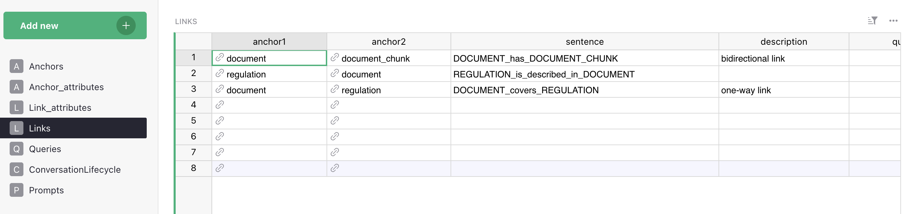
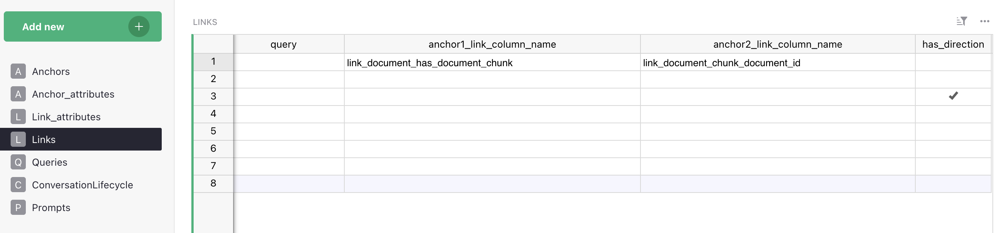
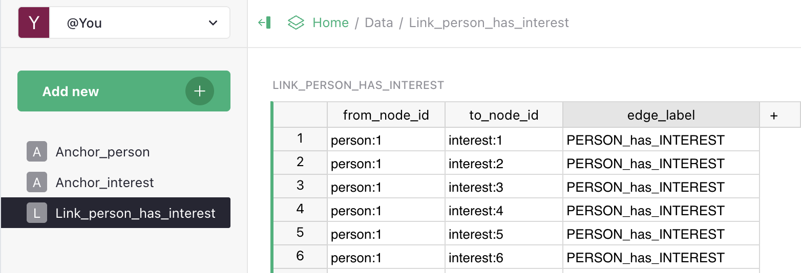

# Links (relationships)

A **link** is a typed relationship between two anchors. If anchors define **entities** and attributes define **properties**, then links define **relationships**.

Links turn isolated nodes into a graph and make traversal, multi-hop reasoning, and structural queries possible. **Without links, Vedana can't navigate the graph — it can only look things up in isolation.**

## Fields

| Field                          | Description                                                                                  |
| ------------------------------ | --------------------------------------------------------------------------------------------- |
| **anchor1**                    | Source entity of the link.                                                                   |
| **anchor2**                    | Target entity of the link.                                                                    |
| **sentence**                   | Edge label in the graph (`PERSON_has_INTEREST`, `PRODUCT_belongs_to_CATEGORY`). Used in Cypher. If you provide link data via its own Grist table (rather than via FK columns on the anchor tables), that table must be named `Link_<sentence>` — ETL discovers link tables by prefix. See [Naming conventions](../architecture/vedana-etl.md#naming-conventions-in-grist). |
| **description**                | Plain-text explanation of the relationship. Goes into the LLM context.                        |
| **query**                      | Cypher to traverse the link. Critical for multi-hop reasoning.                                |
| **anchor1_link_column_name**   | FK column on the anchor1 side (optional).                                                     |
| **anchor2_link_column_name**   | FK column on the anchor2 side (optional).                                                      |
| **has_direction**              | bool. Whether the link is directional.                                                         |

## What you get in the graph





The link `Product → belongs_to → Category` after ETL produces edges:



```
(:product {id: "p-001"}) -[:PRODUCT_belongs_to_CATEGORY]-> (:category {id: "cat-01"})
```

Cypher can now (anchor labels are literal — lowercase singular by convention; the edge label `sentence` is preserved verbatim, see [Adding Links](../guides/adding-links.md)):

```cypher
MATCH (p:product)-[:PRODUCT_belongs_to_CATEGORY]->(c:category)
WHERE c.name = "Laptops"
RETURN p
```

This is impossible with document chunks alone.

## Direction

Every edge in Memgraph has a direction (an arrow from `anchor1` to `anchor2`), but the `has_direction` column on the `Links` table controls whether Vedana **treats** the relationship as directed.

- `has_direction = true` — only the explicit `anchor1 → anchor2` edge is loaded. Cypher must follow the arrow (`-[:LABEL]->`); the reverse direction returns nothing.
- `has_direction = false` (the **default** in `Link` / `dm_links` schema) — ETL automatically duplicates each edge in the opposite direction (`vedana_etl/steps.py:422-450`), so a traversal in either Cypher direction works. In other words, links are **undirected by default**; mark `has_direction=true` when direction is semantically meaningful.

If you need explicit "two named relationships" semantics, you can also create two links with different `sentence`s (`A_likes_B` and `B_liked_by_A`). More expensive, but disambiguates direction-specific attributes.

In Cypher you can always use undirected traversal `MATCH (a)-[r]-(b)` (without an arrow) regardless of the column setting.

## Multi-hop reasoning

Links are what make multi-hop questions possible.

```
Product → belongs_to → Category
Category → regulated_by → LegalDocument
```

With this structure Vedana answers: **"Which legal documents regulate products in category X?"**

That's a query requiring traversal of two links in sequence. Vector search can't do this. Graph traversal can.

```cypher
MATCH (p:product)-[:PRODUCT_belongs_to_CATEGORY]->(c:category)
       -[:CATEGORY_regulated_by_LEGAL_DOCUMENT]->(d:legal_document)
WHERE c.name = $cat_name
RETURN DISTINCT d.title, d.url
```

## Link vs Attribute

A common modeling question. See [Attributes → Attribute vs Link](./data-model/attributes.md#attribute-vs-link) for details.

In short:

- **String attribute** — when the value is simple and used only for reading. `Product.category = "Laptops"`.
- **Link** — when:
  - the target entity has its own attributes;
  - you can query the target entity independently;
  - the target entity participates in other relationships.

The more the target entity participates in the graph, the stronger the case for a link.

## How it affects the assistant

Link descriptions go into the LLM context. The assistant sees which relationships exist, which anchor types are connected, and how to traverse the graph. This lets it generate valid Cypher and avoid inventing relationships that don't exist.

If links aren't defined — the LLM has no graph to explore and falls back to text-based guessing.

## Best practices

- **Verb-like names.** `belongs_to`, `applies_to`, `located_in` — not `link1` or `relation_a`.
- **Consistent direction throughout the model.** If you have `Product → belongs_to → Category`, don't add `Category → contains → Product` in parallel without good reason.
- **Avoid duplicate reverse links** when not necessary — they bloat the graph and the context.
- **Model real-world relationships explicitly.** If your data has a `created_by_user_id` column, that's a `Document → created_by → User` link, not a string attribute with a UUID.

## Common mistakes

- **Encoding relationships as string attributes.** `Product.category = "Laptops"` blocks all traversal; use a link.
- **Too many generic links** (`related_to`, `connected_to`) — reduces graph expressiveness and Cypher precision.
- **Direction not specified** when it's semantically important.
- **Cyclic structures with no clear semantics.** Technically correct, but they confuse LLM reasoning.

All of those reduce the determinism and clarity that make Semantic RAG work.

## What's next

- [Anchors](./data-model/anchors.md)
- [Attributes](./data-model/attributes.md)
- [Adding Links guide](../guides/adding-links.md) — step-by-step.
