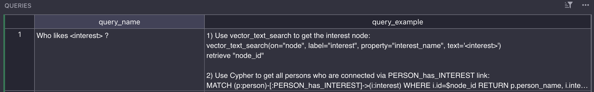
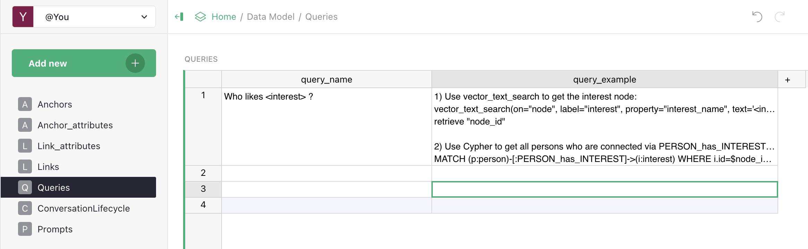

# Queries (playbook)

The **Queries** table is Vedana's playbook. It describes **exactly how** the assistant should answer typical questions: which tool to call first, with what parameters, what to do with the result, which tool to call next.

If the data model describes *what exists*, then Queries describe *how to use it*.



## Fields

| Field              | Description                                                                                                          |
| ------------------ | --------------------------------------------------------------------------------------------------------------------- |
| **query_name**     | A short scenario name or question pattern (`Who likes <interest>?`, `Give product information by SKU`).             |
| **query_example**  | A step-by-step instruction: what to do, in what order, with what parameters, how to handle the result.              |

## Why a playbook is needed

Without one, the LLM picks a tool itself. That works, but:

- it might pick a sub-optimal tool (vector search instead of Cypher);
- it can mix retrieval strategies;
- answers are "usually right" but with no guarantee and not always in the same format.

With a playbook, behaviour becomes **structured, constrained, and auditable**. The same question is always handled the same way.

## How to write a scenario

`query_example` must be **concrete and step-by-step**. Compare:

❌ Bad (generic problem statement):
```
Find the interest and return the people connected to it.
```

✅ Good (a sequence of tool calls with parameters):
```
1) Use vector_text_search to get the interest node:
   vector_text_search(label="interest", property="interest_name", text='<interest>')
   → retrieve "node_id"

2) Use Cypher to get all persons connected via PERSON_has_INTEREST:
   MATCH (p:person)-[:PERSON_has_INTEREST]->(i:interest)
   WHERE i.id=$node_id
   RETURN p.person_name, i.interest_name

3) Format the answer as: "<interest> is liked by: <name1>, <name2>, ..."
```

The LLM follows instructions literally. The more precise the steps, the more stable the behaviour.

## Structure of a good scenario

Each scenario typically contains:

1. **When to apply** — describe the use case ("document-related questions", "product compatibility checks").
2. **Search strategy** — vector → Cypher, Cypher → vector, or a combination.
3. **Concrete tool calls** — with parameter names and where they come from.
4. **Answer assembly** — how exactly the final text is built.

## How Queries reach the LLM

For each request:

1. `DataModel.get_queries()` reads rows from `dm_queries`.
2. (Optional) The data model filtering step picks relevant `query_ids` for the question.
3. `to_text_descr()` renders the chosen queries into the `## Типичные вопросы:` section of the system prompt using `dm_query_descr_template`:

   ```
   - {query.name}
   {query.example}
   ```

4. The LLM uses this as guidance when choosing tools.

## How to update the playbook



1. Open **Grist > Data Model > Queries**.
2. Create a row:
   - `query_name` — the scenario name.
   - `query_example` — the step-by-step instruction.
3. In the backoffice → ETL run `data_model_steps` (or the "Refresh Data Model" tab).
4. Verify via evaluation that existing scenarios didn't break.

The playbook applies right after refresh — no code redeploy required.

## Versioning

Because Queries live in Grist, you have built-in change history through Grist (revision log). For production scenarios we recommend:

- keeping **separate Grist documents** for dev / staging / prod (`GRIST_DATA_MODEL_DOC_ID`);
- describing every playbook change in a separate ticket / changelog;
- having an evaluation on a golden dataset that runs before and after changes.

## Examples from a real playbook

### E-commerce: "Find products of category X cheaper than Y"

```
1) Cypher: get the category nodes:
   MATCH (c:category) WHERE c.category_name = "<category>" RETURN c.id

2) Cypher: get linked products with the price filter:
   MATCH (p:product)-[:PRODUCT_belongs_to_CATEGORY]->(c:category)
   WHERE c.id = $cat_id AND p.price < $max_price
   RETURN p.product_name, p.price ORDER BY p.price ASC

3) Format: list "<name> — <price> EUR".
```

### Documents: "What does the policy say about returns?"

```
1) Vector search over document_chunks:
   vector_text_search(label="document_chunk", property="content", text="<user question>")

2) Get the parent document:
   MATCH (d:document)-[:DOCUMENT_has_DOCUMENT_CHUNK]->(c:document_chunk)
   WHERE c.id IN $chunk_ids RETURN d.title, d.url

3) Format: answer based on the chunks + a link to the document.
```

### Smalltalk

```
If the question is not domain-related (greeting, thanks, farewell):
- DO NOT call tools.
- Reply briefly in a friendly tone.
```

(It's worth describing such scenarios too, so the assistant doesn't call tools unnecessarily.)

## What's next

- [Playbook concept](../concepts/playbook-for-vedana.md) — the theory.
- [Customizing Prompts](../guides/customizing-prompts.md) — overriding templates.
