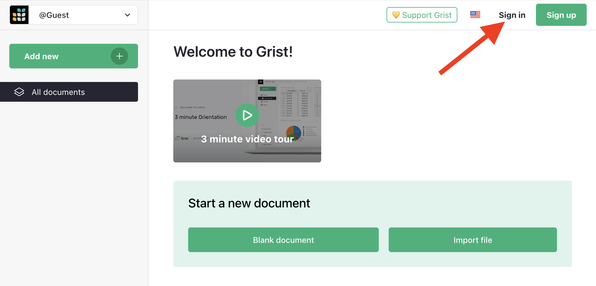
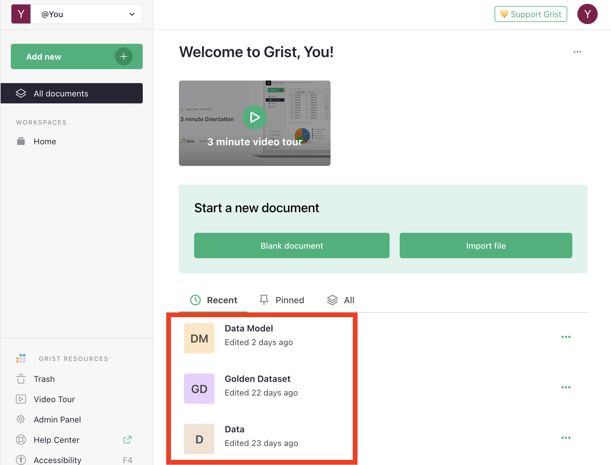
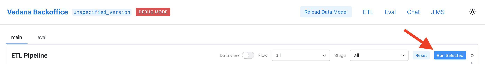
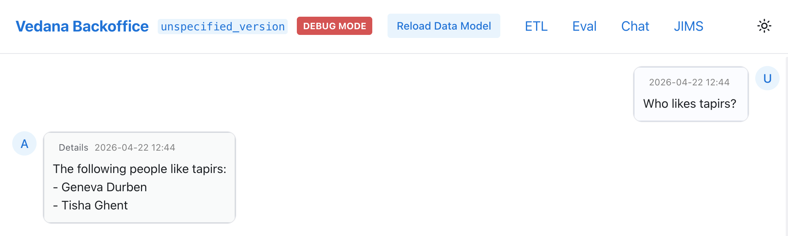
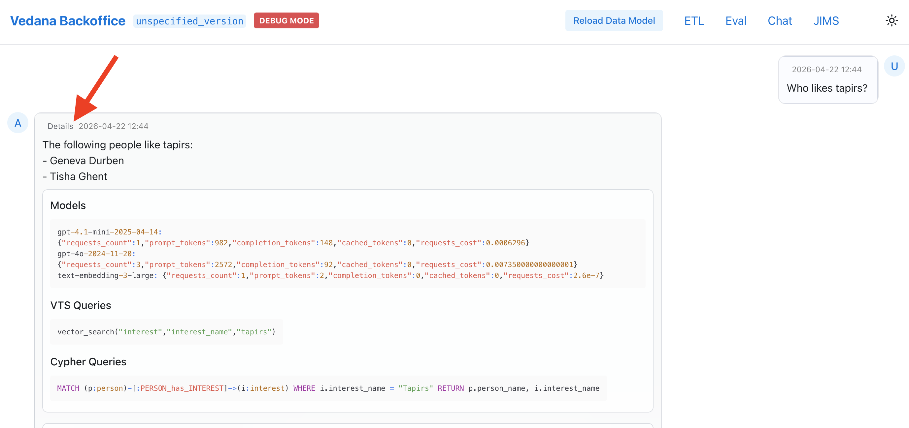

# Quick Start

In 10 minutes you'll:

1. Bring up the entire Vedana stack in Docker.
2. Load the test data model and data.
3. Run the ETL and confirm that the graph was built.
4. Ask your first question.
5. See exactly how the assistant arrived at the answer.

## Prerequisites

- Docker and Docker Compose installed.
- An LLM provider API key: OpenAI, OpenRouter, or Google/VertexAI (any combination — see [LLM configuration](./configuration.md#llm)).
- ~5 GB of free disk space and these ports free: `3000` (Memgraph Lab), `5432` (Postgres), `7444` (Memgraph monitoring HTTP), `7687` (Memgraph Bolt), `8000` and `9000` (Reflex backoffice / Caddy), `8080` (HTTP API), `8090` (Widget), `8484` (Grist).

## Step 1. Clone the repository and prepare `.env`

```bash
git clone https://github.com/epoch8/vedana
cd vedana

cp apps/vedana/.env.example apps/vedana/.env
```

Open `apps/vedana/.env` and set the key for at least one provider. A minimal `.env` for the quick start looks like this:

```env
# At least one of these — pick your provider
OPENAI_API_KEY="sk-..."
# OPENROUTER_API_KEY="sk-or-..."
# GOOGLE_APPLICATION_CREDENTIALS="path-to-creds.json"

# Models (defaults shown — change here if you want)
MODEL="gpt-4.1-mini"
EMBEDDINGS_MODEL="text-embedding-3-large"
EMBEDDINGS_DIM=1024

# Memgraph (already set in .env.example, just confirm)
MEMGRAPH_URI="bolt://memgraph:7687"
MEMGRAPH_USER="neo4j"
MEMGRAPH_PWD="modular-current-bonjour-senior-neptune-8618"

# Postgres (already set in .env.example, just confirm)
JIMS_DB_CONN_URI="postgresql://postgres:postgres@db:5432"
DB_CONN_URI="postgresql://postgres:postgres@db:5432"
```

> **Note on Grist credentials.** `GRIST_API_KEY`, `GRIST_DATA_MODEL_DOC_ID`, `GRIST_DATA_DOC_ID`, and `GRIST_TEST_SET_DOC_ID` are **not set in `.env.example`** — they're hardcoded in `apps/vedana/docker-compose.yml` (under `x-app-common.environment`) and point to a public Grist demo instance with the LIMIT test dataset. That's why the quick start works without you ever signing into Grist. When you switch to your own Grist (self-hosted on `http://grist:8484` or hosted at `getgrist.com`), copy the four `GRIST_*` lines from `.env.example` into `.env` and fill them in with your own values — and remove the hardcoded ones from `docker-compose.yml` so your `.env` wins.

The default models (`gpt-4.1-mini`, `text-embedding-3-large`) can be changed in `.env` — see the [Configuration guide](./configuration.md) and the [Configuration Reference](../api/configuration-reference.md).

> **Picking `MODEL`.** `gpt-4.1-mini` is a good default for the Quick Start and for simple assistants: it's cheap, fast, and works well on a small data model like the LIMIT test dataset. For domains with larger data models, longer Cypher reasoning, or more nuanced answers, consider upgrading `MODEL` to the larger `gpt-4.1`. `FILTER_MODEL` (the data-model filtering step) can usually stay on `gpt-4.1-mini` even when the main `MODEL` is upgraded.

## Step 2. Bring up the stack

```bash
docker compose -f apps/vedana/docker-compose.yml up --build -d
```

Compose starts these services (Telegram bot is **commented out** in the default compose — uncomment the `tg:` block if you need it):

| Service        | Purpose                                              | Port(s)        |
| -------------- | ---------------------------------------------------- | -------------- |
| `app`          | Reflex backoffice + chat + ETL runner (via Caddy)    | 9000, 8000     |
| `api`          | FastAPI HTTP API (`jims-api`)                        | 8080           |
| `widget`       | Embeddable web widget (`jims-widget`)                | 8090           |
| `db`           | PostgreSQL 15 with the `pgvector` extension          | 5432           |
| `memgraph`     | Memgraph (graph DB, Bolt + monitoring HTTP)          | 7687, **7444** |
| `memgraph-lab` | Web inspector for Memgraph                           | 3000           |
| `grist`        | Grist (default source of the data model and data)    | 8484           |

> **What is port 7444?** It's Memgraph's built-in HTTP monitoring endpoint (live snapshots, metrics, replication state). It's exposed because Memgraph Lab uses it to show server stats. You can ignore it — but keep the port free.

The `db-migrate` container automatically applies Alembic migrations before the main app starts.

## Step 3. Verify everything is alive

First, smoke-test the API and Grist via `curl` before opening anything in a browser:

```bash
# HTTP API — should return 200 with `{"detail":"Not Found"}` body or similar (root has no handler, but the server responds)
curl -s -o /dev/null -w "api: %{http_code}\n" http://localhost:8080/docs

# Grist — its own health endpoint
curl -s -o /dev/null -w "grist: %{http_code}\n" http://localhost:8484/api/status

# Memgraph monitoring — returns server info
curl -s -o /dev/null -w "memgraph: %{http_code}\n" http://localhost:7444/

# Backoffice (Caddy)
curl -s -o /dev/null -w "backoffice: %{http_code}\n" http://localhost:9000/
```

All four should print a 2xx or 3xx status code. If any of them fails, run `docker compose -f apps/vedana/docker-compose.yml logs <service>` to see what went wrong.

Then open in your browser:

- Backoffice → <http://localhost:9000>
- HTTP API (Swagger) → <http://localhost:8080/docs>
- Memgraph Lab → <http://localhost:3000>
- Grist → <http://localhost:8484>

The local Grist container ships with three seeded documents — **Data Model**, **Data**, and **Golden Dataset** (the LIMIT test dataset — see [Test Dataset](../guides/test-dataset.md)). They are served from `apps/vedana/infra/grist/docs/` and live entirely on your machine — Quick Start does **not** contact `api.getgrist.com`. The IDs used by ETL (`GRIST_DATA_MODEL_DOC_ID`, `GRIST_DATA_DOC_ID`, `GRIST_TEST_SET_DOC_ID` in `.env.example`) point at these local docs:

- Data Model — <http://localhost:8484/o/docs/j6PTmqgw4caB/Data-Model>
- Data — <http://localhost:8484/o/docs/eB5kH8Z7NVEr/Data>
- Golden Dataset — <http://localhost:8484/o/docs/2FDgbBNtEDmg/Golden-Dataset>

Sign in to Grist and confirm the documents are visible:





## Step 4. Run the ETL

Without ETL the graph is empty and the assistant has nothing to find.

1. Open the backoffice → **ETL** section → <http://localhost:9000/etl>.
2. Click **Run Selected** on the main tab.



ETL does three things: it loads the data model, loads the data, and builds the graph in Memgraph + the embeddings in pgvector. Wait until every step turns green.

## Step 5. Ask your first question

1. Open the chat → <http://localhost:9000/chat>.
2. Ask something about the test dataset (the canonical interest names in LIMIT use capitalised plurals — `Quokkas`, `Tapirs`, `Joshua Trees`):

   - "Who likes Quokkas?"
   - "What are Geneva Durben's interests?"
   - "Who is into Tapirs, and what else are they interested in?"



3. Click **Details** under the answer to see:
   - which Cypher queries the assistant ran;
   - which vector searches were issued;
   - how data model filtering shrank the context.



## Step 6. Stop the stack

```bash
# soft stop
docker compose -f apps/vedana/docker-compose.yml down

# stop and remove volumes (full reset)
docker compose -f apps/vedana/docker-compose.yml down -v
```

## What's next

- [Architecture](../architecture/overview.md) — how the code is structured.
- [Data Model Overview](../data-model/overview.md) — how to describe your own domain.
- [HTTP API](../api/http-api.md) — embed the assistant in your own system.
- [Common mistakes](../product/faq.md#common-mistakes) — typical pitfalls during the first launch.
