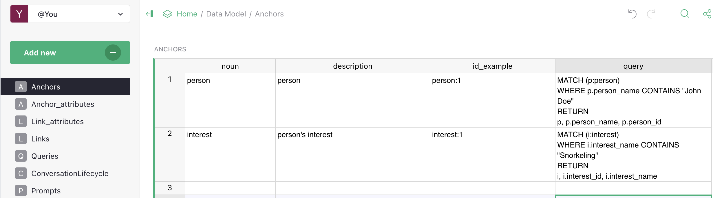
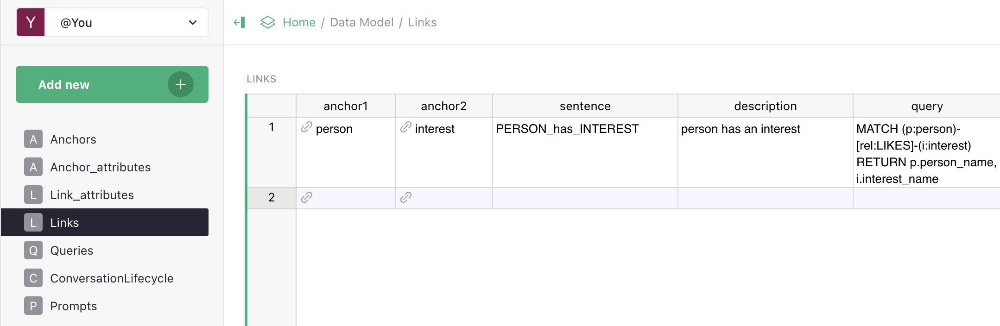

# Setting Up Your Data Model

A step-by-step guide to creating a data model for your domain. The goal: at the end you have a Vedana that's ready to query and answers your domain's typical questions correctly.

## Step 0. Prerequisites

- Run Vedana locally per the [Quick Start](../getting-started/quick-start.md).
- Open Grist on `http://localhost:8484`. You should see three documents: **Data**, **Data Model**, **Golden Dataset**.
- Make a copy of the **Data Model** doc for your project (or create a new one and switch `GRIST_DATA_MODEL_DOC_ID`).

## Step 1. Collect 20–30 typical questions

The most common mistake is to **describe the model first and think about the questions later**. Do the opposite.

Write down (in any format — even directly in a Grist table):

- Specific values: "What is the price of product X?", "When does branch Y open?"
- Lists: "Show me all products of category Z under 1000"
- Relationships: "Who is connected to project A?", "Which documents regulate B?"
- Explanations: "What does the policy say about X?"
- Smalltalk and edge cases: "Hello", "What can you do?", "How much does an electron weigh?"

This will be the basis for your golden dataset (see [Evaluation](../product/evaluation.md)).

## Step 2. Identify entities (anchors)

For each question, decide **what** it's about. The nouns in the question usually hint at anchors.

"How much is **product** X?" → anchor `product`.
"When does **branch** Y open?" → anchor `branch`.
"Which **documents** regulate **category** B?" → anchors `legal_document`, `category`.

Merge similar concepts into one entity. Don't multiply duplicates.

Fill in the **Anchors** table:

| noun       | description                                                                                                | id_example         | query                                                              |
| ---------- | ----------------------------------------------------------------------------------------------------------- | ------------------ | ------------------------------------------------------------------- |
| `product`  | A product in the Acme catalog. Use for questions about prices, availability, or features of specific products. | `product_id: "p-001"` | `MATCH (p:product) WHERE p.product_id = $id RETURN p`              |
| `branch`   | A physical Acme branch/store. Use for questions about address, opening hours, contacts.                    | `branch_id: "b-vno-01"` | `MATCH (b:branch) WHERE b.branch_id = $id RETURN b`             |
| `category` | A catalog category. Groups products by type.                                                                | `category_id: "cat-laptops"` | `MATCH (c:category) WHERE c.category_id = $id RETURN c`     |

## Step 3. Describe attributes

For each anchor, write down every column of data that may be needed. Split into:

- **scalar fields** (numbers, strings, dates, flags) → attributes;
- **references to other anchors** → links (see step 4).

Fill in the **Anchor_attributes** table:

| anchor   | attribute_name | description                | data_example | dtype | embeddable | embed_threshold | query                                                                  |
| -------- | --------------- | -------------------------- | ------------ | ----- | ---------- | --------------- | ----------------------------------------------------------------------- |
| product  | name            | Product name                | "MacBook Air"| str   | true       | 0.7             | `MATCH (p:product {product_id: $id}) RETURN p.name`                    |
| product  | price           | Price in EUR                | 999.0        | float | false      | —               | `MATCH (p:product {product_id: $id}) RETURN p.price`                   |
| product  | in_stock        | Whether it's in stock      | true         | bool  | false      | —               | `MATCH (p:product {product_id: $id}) RETURN p.in_stock`                |
| branch   | address         | Full address                | "Vilnius, ..." | str | true       | 0.7             | `MATCH (b:branch {branch_id: $id}) RETURN b.address`                   |
| branch   | opening_hours   | Hours in JSON                | "{Mon: 09-18}" | str | false      | —               | `MATCH (b:branch {branch_id: $id}) RETURN b.opening_hours`             |

Rules:

- `embeddable=true` only for text fields searched by meaning (names, descriptions).
- `query` is required — otherwise the assistant can't reliably fetch the value.
- `dtype` matches the actual format in Grist.

## Step 4. Describe relationships (links)

Find foreign keys and real relationships:

"product belongs to category", "product is sold at branch", "document regulates category".

Fill in the **Links** table:

| anchor1  | anchor2  | sentence                       | description                  | query                                                                                                       | anchor1_link_column_name | has_direction |
| -------- | -------- | ------------------------------ | ---------------------------- | ------------------------------------------------------------------------------------------------------------ | ------------------------ | ------------- |
| product  | category | `PRODUCT_belongs_to_CATEGORY`  | Product belongs to category. | `MATCH (p:product)-[:PRODUCT_belongs_to_CATEGORY]->(c:category) WHERE p.product_id=$id RETURN c`            | category_id              | true          |
| product  | branch   | `PRODUCT_available_at_BRANCH`  | Product is available at a branch. | `MATCH (p:product)-[:PRODUCT_available_at_BRANCH]->(b:branch) WHERE p.product_id=$id RETURN b`            |                          | true          |
| document | category | `DOCUMENT_regulates_CATEGORY`  | Document regulates a category. | `MATCH (d:document)-[:DOCUMENT_regulates_CATEGORY]->(c:category) WHERE c.category_id=$id RETURN d`         |                          | true          |

## Step 5. Write the playbook (Queries)

For each class of questions from step 1, describe a step-by-step scenario in the **Queries** table.

| query_name | query_example |
| --- | --- |
| Products of category X cheaper than Y | 1) `MATCH (c:category) WHERE c.name="<X>" RETURN c.id` 2) `MATCH (p:product)-[:PRODUCT_belongs_to_CATEGORY]->(c:category) WHERE c.id=$cat_id AND p.price < <Y> RETURN p.name, p.price ORDER BY p.price` |
| Branch opening hours | 1) `vector_text_search(label="branch", property="address", text="<Y>")` → `branch_id` 2) `MATCH (b:branch) WHERE b.id=$branch_id RETURN b.opening_hours` |
| Smalltalk | If the question is a greeting/thanks/farewell: do NOT call tools, reply briefly in a friendly tone. |

See [Queries](../data-model/queries.md) for details.

## Step 6. Tune the system prompt

In the **Prompts** table add a row with `name=generate_answer_with_tools_tmplt` and a body adapted to your domain (tone, address forms, answer format). The default works, but customisation gives a noticeable quality boost.

See [Prompts](../data-model/prompts.md) and [Customizing Prompts](./guides/customizing-prompts.md).

## Step 7. Run the ETL

In the backoffice → ETL → **Run Selected**. Wait for green.

## Step 8. Verify on the golden dataset

1. Put the questions from step 1 into the **Test Set** Grist doc as a golden dataset.
2. In the backoffice → Eval → **Run Selected**.
3. Get a Hit Rate.
4. Analyse the failures:

| Pattern                                  | Likely cause                                                       |
| ---------------------------------------- | ------------------------------------------------------------------ |
| Structural questions failing              | Attribute / link not described, or ETL didn't run.                |
| Document questions failing                | Bad chunking, no embeddings, wrong playbook.                       |
| A whole category fails                    | The playbook routes the intent to the wrong tool.                  |
| Inconsistent on similar questions         | embed_threshold too low or too high.                                |

5. Apply one change → re-run ETL → re-run eval. Compare metrics.

Iterate. One change per iteration. That's how you learn the effect.

## Step 9. Extend

Once the basic domain works (Hit Rate > 0.8), extend:

- add new anchors for additional scenarios;
- add FAQ entries for canonical questions;
- load documents for explanatory content;
- expand the playbook for edge cases.

Each time — iterate: edit → ETL → eval → analyse.

## What's next

- [Adding Anchors](./guides/adding-anchors.md), [Adding Attributes](./guides/adding-attributes.md), [Adding Links](./guides/adding-links.md) — details for each.
- [Tuning Embeddings](./guides/tuning-embeddings.md) — how to choose thresholds.
- [Customizing Prompts](./guides/customizing-prompts.md) — fine-tuning behaviour.
