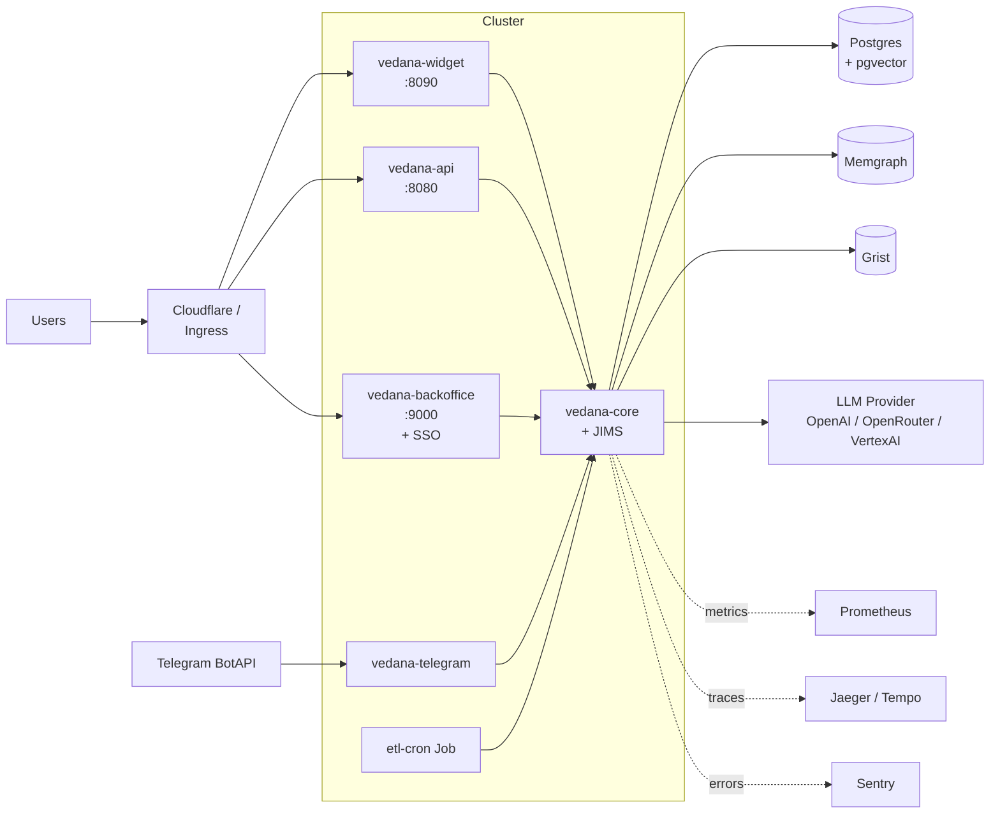

# Deployment

This guide describes three typical Vedana deployment scenarios: local dev, single-node production, and clustered production.

## Local dev

The simplest path is `docker compose -f apps/vedana/docker-compose.yml up --build -d`. See [Quick Start](../getting-started/quick-start.md). Requires nothing beyond Docker.

Suited to:

- development and debugging;
- demos;
- evaluation against the golden dataset.

## Single-node production

For small/medium production, the same docker-compose setup can run on a VPS / dedicated. Minimum configuration:

| Service     | RAM   | CPU | Disk    | Notes                                                  |
| ----------- | ----- | --- | ------- | ------------------------------------------------------ |
| `app`       | 2 GB  | 2   | 5 GB    | Reflex backoffice + Caddy                            |
| `api`       | 1 GB  | 1   | —       | FastAPI (`jims-api`)                                  |
| `widget`    | 1 GB  | 1   | —       | if you need the widget                                |
| `db`        | 4 GB  | 2   | 50+ GB  | Postgres + pgvector. Disk depends on embeddings volume |
| `memgraph`  | 8 GB+ | 2+  | 20 GB   | data in RAM (analytical mode)                         |
| `grist`     | 1 GB  | 1   | 5 GB    | not needed if using managed Grist                    |

Minimum for a case with thousands of nodes and tens of thousands of document chunks: ~16 GB RAM, 8 vCPU, 100 GB SSD.

## Production-grade topology



### Things to definitely change for production

1. **Change every default credential.** The repo ships with several non-empty defaults purely for local Docker Compose — they are **not** safe for production:
   - `MEMGRAPH_PWD="modular-current-bonjour-senior-neptune-8618"` in `apps/vedana/.env.example`,
   - `SENTRY_DSN` (Epoch8 demo project) in `apps/vedana/.env.example`,
   - `POSTGRES_PASSWORD: postgres`, `GRIST_SESSION_SECRET: dev-secret`, and `GRIST_API_KEY: 095081…` hard-coded in `apps/vedana/docker-compose.yml`.
   For production, generate new secrets and inject them via your secrets manager (don't keep them in the repo).
2. **Enable TLS** — Caddy can do it automatically; you only need a public hostname and DNS. You can put nginx/Cloudflare tunnel in front.
3. **Close unnecessary ports.** Only the following should be public:
   - 80/443 (Caddy → backoffice / widget),
   - 443 for the api (if external),
   - everything else — private network only.
4. **Set up backups.**
   - Postgres: pg_dump on a cron to S3 / managed snapshots.
   - Memgraph: snapshot + cypherl dumps (see [Storage Model](../architecture/storage-model.md)).
   - Grist: document export.
5. **Turn on Sentry** — `SENTRY_DSN` + `SENTRY_ENVIRONMENT`.
6. **Turn on Prometheus scraping** — on each service's `--metrics-port`. Defaults differ per service to avoid port collisions when several CLIs run on the same host: `jims-api` / `jims-telegram` / `jims-max` default to **8000**; `jims-widget` defaults to **8001**. In a Compose / Kubernetes setup where each service runs in its own container, you can keep these defaults; if you co-locate services, override with explicit `--metrics-port`. See [API Overview → Common CLI configuration](../api/overview.md).
7. **Pin Docker image versions** — don't use `:latest` for Memgraph and Grist in production. Pin tags.

### A service unit (systemd, as an example)

```ini
[Unit]
Description=Vedana
Requires=docker.service
After=docker.service

[Service]
Type=oneshot
RemainAfterExit=yes
WorkingDirectory=/opt/vedana
ExecStart=/usr/bin/docker compose -f apps/vedana/docker-compose.yml up -d
ExecStop=/usr/bin/docker compose -f apps/vedana/docker-compose.yml down
Restart=on-failure

[Install]
WantedBy=multi-user.target
```

## Kubernetes

For scalable production it's easier to move to Kubernetes. There are no official Helm charts at the time of writing; below are recommendations for assembling your own.

### Splitting into deployments

| Deployment            | Replicas                       | Notes                                                              |
| --------------------- | ------------------------------- | ------------------------------------------------------------------ |
| `vedana-api`           | 2–N stateless                   | scales horizontally. ENV from Secret.                              |
| `vedana-widget`        | 2–N stateless                   | same                                                                |
| `vedana-backoffice`    | 1–2 (state in DB)              | one replica is fine; for HA — two with sticky sessions             |
| `vedana-telegram`      | 1                                | aiogram does long-poll itself; doesn't scale horizontally (TG limit) |
| `etl-cron`             | 1 (CronJob)                    | a CronJob that calls datapipe run every N minutes                  |

### StatefulSets

| StatefulSet  | What's inside                          | PVC                                |
| ------------ | --------------------------------------- | ----------------------------------- |
| `postgres`   | Postgres + pgvector                    | RWO, sized to the data              |
| `memgraph`   | Memgraph (one replica for analytics)   | RWO, for snapshots                  |

For production-grade Postgres prefer an operator (Crunchy / Zalando). For Memgraph — the community / enterprise Memgraph operator (depending on licence).

### Secrets and ConfigMaps

- `vedana-secrets` — all passwords, API keys (`MEMGRAPH_PWD`, `OPENAI_API_KEY`, `SENTRY_DSN`, `TELEGRAM_BOT_TOKEN`, `GRIST_API_KEY`).
- `vedana-config` — non-secret values (`MODEL`, `EMBEDDINGS_MODEL`, `EMBEDDINGS_DIM`).

### Ingress / service mesh

- Backoffice — behind external SSO (Cloudflare Access / Authentik).
- API — behind a reverse proxy with rate limiting and auth headers.
- Widget — public, with a CORS policy.

## CI/CD

The repository uses auto-generated GitHub Actions via [uv-workspace-codegen](https://github.com/epoch8/uv-workspace-codegen). Configuration lives in each library's `pyproject.toml`.

Building packages:

```bash
make build           # uv build per package
make build-vedana-project   # build the Vedana Docker image
```

Publishing (with a GCP token):

```bash
UV_PUBLISH_USERNAME="oauth2accesstoken" \
UV_PUBLISH_PASSWORD="$(gcloud auth print-access-token)" \
make publish
```

In your custom CI:

- run `uv run pytest` on changed packages;
- run a smoke evaluation on a minimal golden dataset on staging;
- build Docker, tag by git sha;
- auto-deploy to staging, prod after approval.

## Migrations

Always apply migrations before releasing a new Vedana image:

```bash
docker compose -f apps/vedana/docker-compose.yml run --rm db-migrate
```

Or in Kubernetes — a separate Job:

```yaml
apiVersion: batch/v1
kind: Job
metadata:
  name: vedana-migrate-{{ .Values.image.tag }}
spec:
  template:
    spec:
      containers:
        - name: migrate
          image: vedana:{{ .Values.image.tag }}
          command: ["uv", "run", "alembic", "upgrade", "head"]
          env: ...
      restartPolicy: Never
```

## Healthchecks for the orchestrator

| Service | Endpoint                    | Description                                                |
| ------- | --------------------------- | ----------------------------------------------------------- |
| api     | `GET /healthz`              | returns `{"status":"ok"}`                                  |
| widget  | `GET /healthz`              | same                                                         |
| telegram | `GET /healthz` on 9000     | aiohttp in the background                                   |
| backoffice | `GET /healthz`            | through the Caddy proxy                                     |
| db      | standard `pg_isready`       | as in docker-compose                                         |
| memgraph | bolt-ping                  | `mgconsole` or `cypher-shell`                              |

Liveness — a simple `/healthz`. Readiness — a request that actually checks DB connectivity (you can build a `/healthz/deep`).

## Cost optimization

See [Cost Management](./operations/costs.md).

## What's next

- [Monitoring & Metrics](./operations/monitoring.md)
- [Troubleshooting](./operations/troubleshooting.md)
- [Cost Management](./operations/costs.md)
